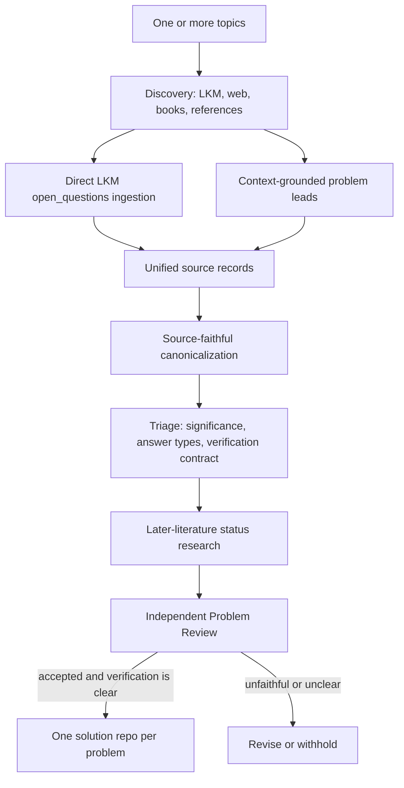

# Open Research Discovery

`open-research-discovery` turns one or more scientific topics into
source-grounded, currently open, independently reviewable research problems.

New schema-v2 campaigns are deliberately broader than the original LKM-only
workflow:

- explicit open questions can come from the dedicated Bohrium LKM paper graph;
- possible problems can be reconstructed from contextual LKM and web search,
  books, datasets, or user-supplied references;
- every source-derived problem must preserve the source's actual context and
  intent;
- literature questions retain their natural generality; verification does not
  manufacture a tractable restricted substitute;
- answer types and verification difficulty are recorded, but neither is a
  publication gate;
- every problem receives a 0-10 scientific-significance score and rationale;
- every accepted problem compiles into its own README-first solution repository,
  with `topic_id` retained for grouping.

Benchmark building and evaluation remain separate explicit workflows. Ordinary
problem generation uses `discovery campaign`.

## First principles

An interesting question is not automatically a usable research problem. A final
problem must satisfy four independent conditions:

1. **Source fidelity** — the question follows from inspected evidence without
   quoting out of context or strengthening the original claim.
2. **Current openness** — later literature leaves a precise nonempty core, with
   the confidence and uncertainty recorded honestly.
3. **Scientific significance** — the repository states what knowledge,
   capability, bound, mechanism, experiment, or decision would change.
4. **Verification clarity** — an independent reviewer can tell exactly what is
   submitted, what is checked, and what passes without redefining or narrowing
   the source problem.

A famous or named problem keeps the primary or standard literature
formulation. A finite-size or parameter-restricted variant may be useful, but it
must be labeled as a derived problem and cannot be presented as the original.
When a literature question is genuinely general, a valid verification contract
describes what evidence would resolve that general question rather than making
it smaller.

## Source routes

Each topic enables one or both routes.

### `lkm_open_questions`

Discovery finds candidate papers. The deterministic pipeline then calls the
direct LKM paper-graph API and preserves the raw response and `trace_id`. Only

```text
data.papers[].open_questions[]
```

is treated as an explicit LKM open-question record. That field establishes the
dedicated retrieval route, but not by itself that the paper's authors posed the
sentence verbatim. Author-level attribution is checked against inspected paper
text during the later audit. Ordinary LKM
`question`, `problem`, `subproblem`, motivation, and variable nodes remain paper
or evidence leads.

In schema v2, each selected paper must also have abstract-level-or-better
evidence, a context summary, and a statement of source intent. The dedicated
open-question sentence is never interpreted in isolation from the paper's
model, assumptions, and scope.

### `topic_search`

Discovery searches LKM and the web adaptively and may inspect books or
user-supplied references. Each proposed lead must contain:

- a stable source identity and locator;
- a verbatim excerpt;
- enough surrounding context to disambiguate the excerpt;
- the source author's actual intent;
- a precise explanation of how the possible research question follows;
- honest content-level labels and evidence relations;
- descriptive possible answer types.

A topic-search lead is not presented as an explicitly declared open question.
Later-literature research must establish whether the reconstructed core is
currently open.

## Workflow



The agent stages return schema-validated artifacts and never mutate the pool.
The deterministic pipeline owns identifiers, caching, retries, mechanical
field derivation, compilation, pool synchronization, and ranking.

## Installation

Requirements:

- Python 3.11 or newer;
- [`uv`](https://docs.astral.sh/uv/);
- an authenticated `codex` CLI with `codex exec` (or the Kimi Code CLI,
  `kimi`, when the campaign selects `agents.backend: kimi`);
- the Gaia CLI on `PATH` for exploratory LKM retrieval;
- a Bohrium LKM access key for direct paper-graph ingestion.

Clone and install:

```bash
git clone https://github.com/kunyuan/open-research-discovery.git
cd open-research-discovery
uv sync --dev
```

Verify the external tools and configure the LKM key without writing it into
the repository:

```bash
codex --version
gaia --version
export LKM_ACCESS_KEY="<your Bohrium access key>"
```

The access key must never be committed, logged, embedded in a campaign file,
or included in an agent prompt.

## Quick start

Create a schema-v2 campaign from one or more topics:

```bash
uv run discovery campaign init \
  --topic "Hubbard model" \
  --topic "quantum thermalization" \
  --out campaign.yaml
```

Both source routes are enabled by default. They may be selected explicitly:

```bash
uv run discovery campaign init \
  --topic "protein folding dynamics" \
  --source lkm_open_questions \
  --source topic_search \
  --out campaign.yaml
```

Inspect the generated YAML, add seed papers or references when useful, then run:

```bash
uv run discovery campaign run campaign.yaml
```

Resume or inspect a run:

```bash
uv run discovery campaign resume /path/to/run
uv run discovery campaign status /path/to/run
```

Remote repository creation or push is never automatic; it requires explicit
authorization.

## Schema-v2 configuration

```yaml
schema_version: 2
name: quantum-many-body-open-problems

topics:
  - id: quantum-many-body
    title: Quantum Many-Body Physics
    query: >-
      Find source-faithful, currently open, independently verifiable research
      problems in quantum many-body physics.
    sources:
      - lkm_open_questions
      - topic_search
    seed_papers: []
    seed_references:
      - kind: book
        title: 10000 Scientific Problems — Physics Volume
        identifier: private-reference
        url: ''
        locator: relevant chapter
        excerpt: ''

limits:
  papers_per_domain: 10
  questions_per_domain: 100
  leads_per_topic: 100
  max_decomposition_depth: 1
  max_audited_candidates_per_topic: 6
  lkm_timeout_seconds: 60

agents:
  model: ''
  codex_executable: codex
  networked_sandbox: workspace-write
  network_access: true
  workers: 4
  networked_workers: 4
  retries: 1
  retry_backoff_seconds: 5
  sandbox: read-only
  timeout_seconds: 3600

outputs:
  runs_root: ./work/runs
  problem_root: ./work/solutions
  pool_root: ./work/problem-pool
```

Campaigns default to four ordinary workers and four network-enabled workers.
Explicit per-campaign values may still lower either bound when required by an
API quota or local resource limit.

`max_verification_difficulty` is intentionally absent. Schema-v2 campaigns
always record verification difficulty from 0 to 10, but never use it as a
publication threshold. Schema-v1 campaigns and frozen benchmarks retain their
historical threshold semantics only for reproducibility.

### Agent backends

`agents.backend` selects the headless agent CLI: `codex` (default) or `kimi`.
The `kimi` backend runs the Kimi Code CLI
(`kimi -p <prompt> --output-format stream-json`, installable from
[kimi-code](https://github.com/MoonshotAI/kimi-cli); authenticate it before
running a campaign) and honors `agents.kimi_executable` (default `kimi`) and
`agents.model`. Kimi has no `--output-schema` structured-output mode, so the
schema constraint is carried by prompt instruction and enforced by
deterministic parsing and validation after each call; contract failures remain
non-retryable. Kimi also has no sandbox flag: unlike the Codex backend, role
isolation relies only on environment sanitization (secrets stay out of
non-networked roles), prompt instruction, and output validation — there is no
OS-level sandbox around the agent process. Benchmark evaluation accepts the
same choice via `discovery benchmark evaluate --backend kimi`.

## Context and canonicalization contract

Before formulating a problem, the pipeline must have enough context to identify:

- the source's object, assumptions, population, or physical regime;
- relevant definitions, observables, data, baselines, or conventions;
- what prior work established and what it did not establish;
- whether the source is asking a question, stating a limitation, motivating a
  direction, or merely describing adjacent work;
- how the proposed research problem follows without changing scope.

Canonicalization merges equivalent formulations and splits only genuinely
conjunctive source questions. It preserves the source problem's natural
generality and does not add a finite size, parameter interval, geometry, method,
observable, or answer-form restriction for verification convenience. Famous or
named problems are aligned to an authoritative formulation; restricted variants
are labeled separately. Each candidate records its parent topic,
source-specific excerpts, descriptive answer types, a preliminary verification
plan, and a formulation rationale.
The parent `topic_id` is derived from the candidate's source records; an agent
cannot turn a subtheme into a new repository container. For topic-search leads,
the literal `exact_excerpt` must occur inside `surrounding_context`, and a
contract violation fails the Discovery stage instead of becoming a reusable
completed artifact.

## Verification contract

Every final problem has:

- `verification_clarity: clear`;
- a concrete `verification_standard`;
- a result-focused review checklist;
- an acceptance boundary that evaluates the source-faithful statement rather
  than narrowing it;
- `verification_difficulty` from 0 to 10;
- optional scientifically meaningful CI.

The score measures residual independent-review burden, not solve difficulty:

- `0`: pinned mechanical checks, replay, or certificates discharge every
  load-bearing claim;
- `1-3`: a few independent local reasoning units remain;
- `4-6`: connected derivations or substantial specification reconstruction;
- `7-9`: long, fragile, or novel reasoning chains;
- `10`: the essential claim cannot be decomposed into independent checks.

A score of 10 is not a rejection. An unclear verification standard is.

If clarity is `needs_decomposition` or `unverifiable`, at least one proposed
subproblem is required, and each must be a source-supported component or an
independently useful review unit that preserves the parent claim; `clear`
requires an empty subproblem list. A favorable finite instance is not a
decomposition of a general question. Schema-v2 campaigns may materialize valid
components as child candidates and triage them again up to
`max_decomposition_depth`; the rest are retained in the persistent topic queue
(see below) instead of being dropped. Only high- or
medium-importance candidates with `verification_clarity: clear` proceed to the
expensive later-literature audit. The optional
`max_audited_candidates_per_topic` budget selects clear candidates by scientific
significance and importance; verification difficulty is never part of that
selection. The pipeline does not make a vague theme appear verifiable by
inventing a proxy benchmark, arbitrary numerical threshold, or favorable finite
instance.

## Topic queue and retention

Schema-v2 campaigns retain every literature-grounded scientific question, even
when it is not yet specific enough to audit. Whenever triage or research
returns `verification_clarity` other than `clear`, the proposed subproblems are
appended to a persistent queue at `<runs_root>/topic-queue.jsonl`; pending
entries are replayed into canonicalization automatically by the next campaign
(`pending` → `consumed`) as `queue:<queue_id>` derived-subproblem sources.
`unverifiable` therefore means "must be decomposed", never "discarded" — see
[docs/discovery-pipeline.md](docs/discovery-pipeline.md) for the queue
lifecycle.

## Answer types

Answer types describe what a scientifically meaningful submission may contain.
Examples include:

- proof or counterexample;
- exact solution or explicit construction;
- simulation or numerical result with a pinned model and protocol;
- experiment or measurement with declared observables and uncertainty;
- dataset or benchmark result when the scientific target is genuinely a fixed
  dataset or benchmark;
- classification, bound, algorithm, mechanism, or validated explanatory model.

They do not rank or gate problems and do not prescribe a method.

## Scientific significance

Every candidate and final problem receives a `scientific_significance_score`
from 0 to 10 plus a rationale. The rationale must be specific: it should say
what accepted knowledge or capability changes, who or what line of work depends
on it, and whether the contribution resolves a bottleneck, distinguishes
mechanisms, opens a regime, changes a bound, or enables a new measurement or
computation.

Ranking prioritizes current-open status and scientific significance.
Verification difficulty remains visible as reviewer workload and a secondary
scheduling signal, never as a proxy for scientific value.

## Solution repository contract

Schema-v2 compilation creates one repository per accepted problem:

```text
ORP-0001-problem-slug/
  README.md
  .git/
```

Each problem receives a stable `ORP-*` ID and retains `topic_id` as grouping
metadata. Its README has exactly these top-level sections:

1. Background;
2. Problem Statement;
3. Scientific Significance;
4. Answer Types;
5. Verification Standard;
6. Current Progress;
7. References.

Raw retrieval responses, structured manifests, audit evidence, and pool views
remain outside the generated repository. Problem-specific code, data, or CI may
be added later only when its scientific acceptance contract needs them.

## Run artifacts

Schema-v2 runs preserve:

```text
campaign.yaml
state.json
source-records.json
canonicalization.json
ranking.json
domains/<topic-id>/
  source-papers.json
  source-records.json
  evidence/
candidates/<candidate-id>/
  source-records.json
  canonicalization.json
  triage.json
  research.json
  report.md
  problem-review-verdict.json
  problem.yaml
  compile.json
  depublication.json  # only when a published candidate is later withdrawn
```

`research.json` holds the validated Research draft (nested problem draft,
`report_markdown`, and structured subproblem proposals); `report.md` is the
free-form audit narrative rendered from it. Legacy schema-v1 campaigns write a
flat `assessment.json` instead of these two files.

The dedicated LKM route also keeps each raw paper-graph response and extraction.

## Benchmark workflow

Benchmark construction and evaluation are separate from ordinary problem
generation:

```bash
uv run discovery benchmark build campaign.yaml
uv run discovery benchmark evaluate DATASET --out predictions
uv run discovery benchmark score --predictions predictions --gold gold
```

Frozen schema-v1 benchmark datasets may retain the historical verification
threshold as part of their evaluation label. That legacy label must not leak
back into schema-v2 problem publication.

## Troubleshooting

- A failed or invalidated candidate stage can be retried without rerunning the
  campaign:

  ```bash
  uv run discovery case retry /path/to/run CANDIDATE_ID STAGE --defer
  uv run discovery campaign resume /path/to/run
  ```

  `--defer` only invalidates the stage and marks the candidate
  `retry_requested`; the next `campaign resume` executes the retry.
- Headless Codex failures: inspect the candidate's `events/*.stderr.log` and
  stage metadata under the run directory, repair the external dependency or
  prompt/schema issue, then retry the exact stage and resume.
- Resume refuses a modified campaign file: the configuration is hashed at
  creation. Restore the original file or start a new run.
- `LKM_ACCESS_KEY is not set`: export it in the environment that starts the
  pipeline; never place it in YAML.

See [docs/discovery-pipeline.md](docs/discovery-pipeline.md) for the detailed
control and data flow, including run locking and recovery semantics.

## Development

```bash
uv run pytest
make check
```

The most important regression boundaries are:

- strict direct-LKM extraction remains strict;
- topic-search leads require exact context and honest provenance;
- source context survives canonicalization and review;
- verification cannot narrow or redefine the source problem;
- famous problems remain aligned with authoritative literature formulations;
- verification difficulty never gates schema-v2 publication;
- every accepted problem compiles into its own solution repository;
- benchmark commands remain separate from the default campaign workflow.
