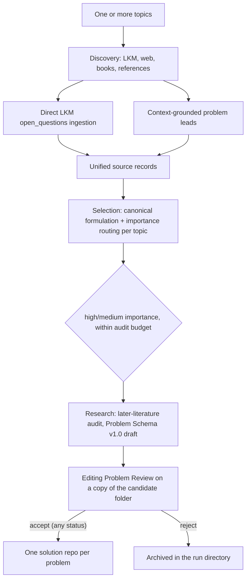

# Open Research Discovery

`open-research-discovery` turns one or more scientific topics into
source-grounded, currently open, independently reviewable research problems.

Campaigns are deliberately broader than a plain LKM-only lookup:

- explicit open questions can come from the dedicated Bohrium LKM paper graph;
- possible problems can be reconstructed from contextual LKM and web search,
  books, datasets, or user-supplied references;
- every source-derived problem must preserve the source's actual context and
  intent;
- literature questions retain their natural generality; verification does not
  manufacture a tractable restricted substitute;
- answer types and verification difficulty are recorded, but neither is a
  publication gate;
- every problem carries a high/medium/low affected-field significance level
  with a specific description;
- every accepted problem compiles into its own README-first solution repository,
  with `topic_id` retained for grouping.

Benchmark building and evaluation remain separate explicit workflows. Ordinary
problem generation uses `discovery campaign`.

## First principles

An interesting question is not automatically a usable research problem. A final
problem must satisfy four independent conditions:

1. **Source fidelity** — the question follows from inspected evidence without
   quoting out of context or strengthening the original claim.
2. **Current openness** — later literature leaves a precise nonempty core, with
   the confidence and uncertainty recorded honestly.
3. **Scientific significance** — the repository states what knowledge,
   capability, bound, mechanism, experiment, or decision would change.
4. **Verification clarity** — an independent reviewer can tell exactly what is
   submitted, what is checked, and what passes without redefining or narrowing
   the source problem.

A famous or named problem keeps the primary or standard literature
formulation. A finite-size or parameter-restricted variant may be useful, but it
must be labeled as a derived problem and cannot be presented as the original.
When a literature question is genuinely general, a valid verification contract
describes what evidence would resolve that general question rather than making
it smaller.

## Source routes

Each topic enables one or both routes.

### `lkm_open_questions`

Discovery finds candidate papers. The deterministic pipeline then calls the
direct LKM paper-graph API and preserves the raw response and `trace_id`. Only

```text
data.papers[].open_questions[]
```

is treated as an explicit LKM open-question record. That field establishes the
dedicated retrieval route, but not by itself that the paper's authors posed the
sentence verbatim. Author-level attribution is checked against inspected paper
text during the later audit. Ordinary LKM
`question`, `problem`, `subproblem`, motivation, and variable nodes remain paper
or evidence leads.

Each selected paper must also have abstract-level-or-better
evidence, a context summary, and a statement of source intent. The dedicated
open-question sentence is never interpreted in isolation from the paper's
model, assumptions, and scope.

### `topic_search`

Discovery searches LKM and the web adaptively and may inspect books or
user-supplied references. Each proposed lead must contain:

- a stable source identity and locator;
- a verbatim excerpt;
- enough surrounding context to disambiguate the excerpt;
- the source author's actual intent;
- a precise explanation of how the possible research question follows;
- honest content-level labels and evidence relations;
- descriptive possible answer types.

A topic-search lead is not presented as an explicitly declared open question.
Later-literature research must establish whether the reconstructed core is
currently open.

## Workflow



The pipeline is strictly one-directional: there are no revision loops, retry
workflows, or cross-campaign re-issuance. A candidate that fails anywhere is
archived in the run directory with its context and verdict.

Each stage's context travels through pipeline-written `memory.md` files: one
per topic (`domains/<topic>/memory.md`) and one per candidate
(`candidates/<id>/memory.md`). Every agent's world is a folder prepared for
it: Discovery works in the topic directory itself, Selection in a freshly
copied `domains/<topic>/selection-workdir/` (memory plus the source-record
JSON), Research in the candidate directory, and the Problem Reviewer in a
copied `review-workdir/` — each agent's prompt opens with "First read
./memory.md for full context." (Discovery's instruction is conditional — on a
fresh run its memory.md does not exist yet). Only the deterministic pipeline
writes these files — after each stage commits — and agents only read them,
with one exception: the Research and Problem Reviewer agents also leave
their own notes behind. Naming convention: pipeline memory is always
`memory.md`; agent-written notes are `<role>-memory.md` — the Research
Agent's `research-memory.md` stays in the candidate directory, and the
reviewer's `review-memory.md` is archived back there from the review copy.

Research and the Problem Review are both network-enabled, directory-scoped
stages. The Research Agent's world is the candidate directory: it audits
later literature and returns the Problem Schema v1.0 record. The pipeline
then copies the whole candidate folder to `review-workdir/`, and the Problem
Reviewer sees only that copy: it verifies the literature and citations
online, fixes formatting, makes the problem statement self-contained and
unambiguous, and returns the corrected full record. The reviewer may also
override the audited status when online evidence shows the problem is
settled (`resolved-externally` / `refuted-externally`) or genuinely unclear
(`uncertain`), as long as it cites the external evidence in `concerns` or
`previous_progress` — a status change without cited evidence is a contract
failure, and accepted resolved problems still compile. Every other
mechanical field
(problem ID, domain, topic, repository) is pipeline-owned — any
drift in them is a contract failure — and compilation uses the reviewed
record.

The agent stages return schema-validated artifacts and never mutate the pool.
The deterministic pipeline owns identifiers, caching, crash recovery, agent
invocation retries, compilation, pool synchronization, and ranking.

## Installation

Requirements:

- Python 3.11 or newer;
- [`uv`](https://docs.astral.sh/uv/);
- an authenticated `codex` CLI with `codex exec` (or the Kimi Code CLI,
  `kimi`, or the Claude Code CLI, `claude`, when the campaign selects the
  corresponding `agents.backend`);
- the Gaia CLI on `PATH` for exploratory LKM retrieval;
- a Bohrium LKM access key for direct paper-graph ingestion.

Clone and install:

```bash
git clone https://github.com/kunyuan/open-research-discovery.git
cd open-research-discovery
uv sync --dev
```

Verify the external tools and configure the LKM key without writing it into
the repository:

```bash
codex --version
gaia --version
export LKM_ACCESS_KEY="<your Bohrium access key>"
```

The access key must never be committed, logged, embedded in a campaign file,
or included in an agent prompt.

## Quick start

Create a campaign from one or more topics:

```bash
uv run discovery campaign init \
  --topic "Hubbard model" \
  --topic "quantum thermalization" \
  --out campaign.yaml
```

Both source routes are enabled by default. They may be selected explicitly:

```bash
uv run discovery campaign init \
  --topic "protein folding dynamics" \
  --source lkm_open_questions \
  --source topic_search \
  --out campaign.yaml
```

Inspect the generated YAML, add seed papers or references when useful, then run:

```bash
uv run discovery campaign run campaign.yaml
```

Resume or inspect a run:

```bash
uv run discovery campaign resume /path/to/run
uv run discovery campaign status /path/to/run
```

Remote repository creation or push is never automatic; it requires explicit
authorization.

## Configuration

```yaml
schema_version: 2
name: quantum-many-body-open-problems

topics:
  - id: quantum-many-body
    title: Quantum Many-Body Physics
    query: >-
      Find source-faithful, currently open, independently verifiable research
      problems in quantum many-body physics.
    sources:
      - lkm_open_questions
      - topic_search
    seed_papers: []
    seed_references:
      - kind: book
        title: 10000 Scientific Problems — Physics Volume
        identifier: private-reference
        url: ''
        locator: relevant chapter
        excerpt: ''

limits:
  papers_per_domain: 10
  questions_per_domain: 100
  leads_per_topic: 100
  lkm_timeout_seconds: 60

agents:
  model: ''
  codex_executable: codex
  claude_executable: claude
  networked_sandbox: workspace-write
  network_access: true
  workers: 32
  networked_workers: 32
  retries: 1
  retry_backoff_seconds: 5
  sandbox: read-only
  timeout_seconds: 3600

outputs:
  runs_root: ./work/runs
  problem_root: ./work/solutions
  pool_root: ./work/problem-pool
```

Campaigns default to 32 ordinary workers and 32 network-enabled workers
(hard cap: 128 each). Explicit per-campaign values may still lower either
bound when required by an API quota or local resource limit.

Campaigns always record verification difficulty from 0 to 10 as reviewer
workload metadata, but never use it as a publication threshold.

### Agent backends

`agents.backend` selects the headless agent CLI: `codex` (default), `kimi`,
or `claude`.

The `kimi` backend runs the Kimi Code CLI
(`kimi -p <prompt> --output-format stream-json`, installable from
[kimi-code](https://github.com/MoonshotAI/kimi-cli); authenticate it before
running a campaign) and honors `agents.kimi_executable` (default `kimi`) and
`agents.model`.

The `claude` backend runs the Claude Code CLI
(`claude -p <prompt> --output-format json`; authenticate it before running a
campaign) and honors `agents.claude_executable` (default `claude`) and
`agents.model`.

Both `kimi` and `claude` lack an `--output-schema` structured-output mode, so
the schema constraint is carried by prompt instruction and enforced by
deterministic parsing and validation after each call; contract failures remain
non-retryable. Neither backend has a sandbox flag: unlike the Codex backend,
role isolation relies only on environment sanitization (secrets stay out of
non-networked roles), prompt instruction, and output validation — there is no
OS-level sandbox around the agent process. Quality-benchmark evaluation
accepts the same choice via `discovery quality evaluate --backend kimi` or
`--backend claude`.

## Context and selection contract

Before formulating a problem, the pipeline must have enough context to identify:

- the source's object, assumptions, population, or physical regime;
- relevant definitions, observables, data, baselines, or conventions;
- what prior work established and what it did not establish;
- whether the source is asking a question, stating a limitation, motivating a
  direction, or merely describing adjacent work;
- how the proposed research problem follows without changing scope.

Selection runs once per topic: it merges equivalent formulations, splits only
genuinely conjunctive source questions, and routes each canonical candidate
with an importance level and a free-form assessment that the pipeline appends
to the candidate's `memory.md` as Research context. It
preserves the source problem's natural
generality and does not add a finite size, parameter interval, geometry, method,
observable, or answer-form restriction for verification convenience. Famous or
named problems are aligned to an authoritative formulation quoted from the
source context; restricted variants are labeled as derived in the assessment.
Each candidate records
source-specific excerpts.
Every candidate belongs to the topic whose records it cites; an agent
cannot turn a subtheme into a new repository container. For topic-search leads,
the literal `exact_excerpt` must occur inside `surrounding_context`, and a
contract violation fails the Discovery stage instead of becoming a reusable
completed artifact.

## Verification contract

Every final problem follows
[Problem Schema v1.0](docs/problem-schema-v1.0.md)
(`schemas/problem.schema.json`). Its verification half has:

- `verification_contract` keyed by answer type: each entry states what an
  answer of that type must submit, what the reviewer checks to pass or fail
  it, and an optional `ci_contract` for the mechanically executable part;
- `verification_difficulty` — a 0-10 `score` plus `rationale`, produced by the
  Research stage.

The score measures residual independent-review burden, not solve difficulty:

- `0`: pinned mechanical checks, replay, or certificates discharge every
  load-bearing claim;
- `1-3`: a few independent local reasoning units remain;
- `4-6`: connected derivations or substantial specification reconstruction;
- `7-9`: long, fragile, or novel reasoning chains;
- `10`: the essential claim cannot be decomposed into independent checks.

A score of 10 is not a rejection; it is reviewer-workload metadata.

Only high- or medium-importance candidates proceed to the expensive
later-literature audit — importance is the only selection gate. By default
every candidate that passes this gate is audited (no budget cap). Set the
optional `max_audited_candidates_per_topic` limit to cap audits per topic when
cost or runtime matters; candidates beyond the cap are archived as deferred in
the run directory. Verification difficulty is never part of that selection.
The pipeline does not make a vague theme appear verifiable by
inventing a proxy benchmark, arbitrary numerical threshold, or favorable finite
instance.

## Archival and retention

There is no cross-campaign queue: a candidate that is not published stays in
its run directory — the candidate directory keeps its source records, the
selection routing, the research draft, and the review verdict, and its
`memory.md` preserves the full stage context for a human reading the run. A
later campaign starts fresh from its own sources.

The pool receives every accepted problem. Active records (`ready`, `open`,
`uncertain`) sync to `pool/problems/`; records the reviewer marked
`resolved-externally` or `refuted-externally` sync to `pool/resolved/` —
settled problems stay compiled and inspectable instead of being discarded.
`catalog.jsonl` covers both folders (each record carries its `status` and
`snapshot` path), and resolved records sort last in the ranking with
`ranking_lane: resolved`.

## Answer types

Answer types describe what a scientifically meaningful submission may contain.
Examples include:

- proof or counterexample;
- exact solution or explicit construction;
- simulation or numerical result with a pinned model and protocol;
- experiment or measurement with declared observables and uncertainty;
- dataset or benchmark result when the scientific target is genuinely a fixed
  dataset or benchmark;
- classification, bound, algorithm, mechanism, or validated explanatory model.

They do not rank or gate problems and do not prescribe a method.

## Scientific significance

Every audited candidate records `scientific_significance.affected_field`: a
`level` (high/medium/low) plus a `description`, produced by the Research stage
(Selection routes by coarse importance and does not score). The description
must be specific: it should say what accepted knowledge or capability changes,
who or what line of work depends on it, and whether the contribution resolves
a bottleneck, distinguishes mechanisms, opens a regime, changes a bound, or
enables a new measurement or computation.

Ranking orders by current-open status, then affected-field significance level,
then verification difficulty. Verification difficulty remains visible as
reviewer workload, never as a proxy for scientific value.

## Solution repository contract

Compilation creates one repository per accepted problem:

```text
ORP-0001-problem-slug/
  README.md
  .git/
```

Each problem receives a stable `ORP-*` ID and retains `topic_id` as grouping
metadata. Its README has exactly these top-level sections:

1. Background;
2. Problem Statement;
3. Current Progress;
4. Scientific Significance;
5. Answer Types;
6. Verification Standard;
7. Suggested CI;
8. References.

Raw retrieval responses, structured manifests, audit evidence, and pool views
remain outside the generated repository. Problem-specific code, data, or CI may
be added later only when its scientific acceptance contract needs them.

## Run artifacts

Runs preserve:

```text
campaign.yaml
state.json
source-records.json
selection.json
selection-repairs.json   # only when excerpt repairs were applied
cross-topic-dedup.json   # only when cross-topic LKM duplicates were found
ranking.json
schemas/problem-review.schema.json  # the materialized review contract
domains/<topic-id>/
  memory.md              # topic-level context: source records + routing
  source-papers.agent.json
  source-papers.json
  source-records.json
  selection.json
  selection-workdir/     # the prepared folder the Selection Agent ran in
  lkm-sweep.json         # lkm_open_questions route only
  evidence/
candidates/<candidate-id>/
  memory.md              # candidate-level context, seeded at selection and
                         # appended by the research and review stages
  research-memory.md     # the Research Agent's own audit notes
  review-memory.md       # the reviewer's notes, archived from review-workdir
  source-papers.json
  source-records.json
  selection.json
  research.json
  problem-review-verdict.json  # verdict + concerns + the reviewed record
  review-workdir/        # the full candidate-folder copy the reviewer edited
  problem.yaml           # accepted candidates only
  compile.json           # accepted candidates only
```

`selection.json` holds the Selection Agent output for one topic (canonical
candidates with routing fields); the per-candidate copy adds the
pipeline-assigned identity. `research.json` holds the Research Agent's Problem
Schema v1.0 draft after pipeline injection of the mechanical fields (problem
ID, status, domain, topic, repository); for accepted candidates the reviewed
record in `problem-review-verdict.json` supersedes it at compilation. The
problem manifest follows
[Problem Schema v1.0](docs/problem-schema-v1.0.md).

The dedicated LKM route also keeps each raw paper-graph response and extraction.

## Benchmark workflow

The problem-quality benchmark audits the finished artifact. It is separate
from ordinary problem generation. `discovery quality build` collects published
problem manifests (from a campaign run, the problem pool, or bare manifest
paths), freezes citation metadata for every identifier they cite, and
`discovery quality evaluate` scores each case with a blind offline reviewer
on five dimensions (citation accuracy, openness argument, scope fidelity,
verification executability, evidence relevance). `discovery quality score`
adds deterministic mechanical checks — citation cross-checks against the
frozen metadata, README contract validation, and cross-case duplicate
detection — and reports per-dimension accuracy against expert gold labels,
or a standalone defect report when no gold exists. The same agent output never
serves as both prediction and gold. See
[docs/problem-quality-benchmark.md](docs/problem-quality-benchmark.md).

## Troubleshooting

- A candidate whose research or review stage failed is quarantined as
  `research_failed` without aborting the run; the summary lists it under
  `failed_candidates`. Because a failed stage leaves no ledger cache, a plain
  resume re-runs it:

  ```bash
  uv run discovery campaign resume /path/to/run
  ```

- Headless agent failures: inspect the candidate's `events/*.stderr.log` and
  stage metadata under the run directory, repair the external dependency or
  prompt/schema issue, then resume the run.
- Resume refuses a modified campaign file: the configuration is hashed at
  creation. Restore the original file or start a new run.
- `LKM_ACCESS_KEY is not set`: export it in the environment that starts the
  pipeline; never place it in YAML.

See [docs/discovery-pipeline.md](docs/discovery-pipeline.md) for the detailed
control and data flow, including run locking and recovery semantics.

## Development

```bash
uv run pytest
make check
```

The most important regression boundaries are:

- strict direct-LKM extraction remains strict;
- topic-search leads require exact context and honest provenance;
- source context survives selection and review (via the pipeline-written
  `memory.md` files every agent reads);
- verification cannot narrow or redefine the source problem;
- famous problems remain aligned with authoritative literature formulations;
- verification difficulty never gates publication;
- every accepted problem compiles into its own solution repository;
- benchmark commands remain separate from the default campaign workflow.
