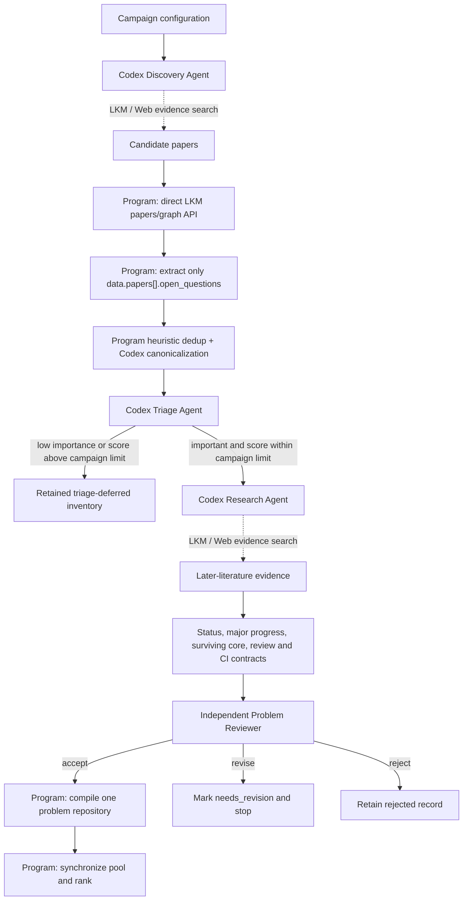

# Open Research Discovery

`open-research-discovery` is a discipline-neutral pipeline for finding
source-grounded open research questions, checking whether they are still
scientifically meaningful, and packaging the strongest candidates as
independently reviewable Git repositories.

The package is designed for research agents, but it does not ask one large
agent to improvise the entire workflow. A deterministic program owns control
flow, provenance, schemas, retries, IDs, state, repository generation, pool
synchronization, and ranking. A small number of headless Codex roles make the
scientific judgments that cannot be reduced to stable code.

The result is not merely a list of interesting-looking questions. For every
admitted problem, the pipeline records:

- the exact source open-question text and paper provenance;
- a canonical, atomic statement of the problem;
- what later literature has resolved, narrowed, or reframed;
- the precise surviving open core;
- why solving it would matter;
- what a correct final result would contain;
- whether a future reviewer needs only the result or must also inspect a
  derivation;
- an optional executable CI contract or problem-specific pseudocode;
- one independent repository that a solver agent can work in.

The public toolkit intentionally does not contain the private problem corpus.
Curated questions, raw LKM responses, later-literature evidence, benchmark
labels, and dispatch state belong in the companion
`open-research-problem-pool`. Solver submissions belong in one repository per
problem.

## Contents

- [Why this package exists](#why-this-package-exists)
- [Design from first principles](#design-from-first-principles)
- [End-to-end architecture](#end-to-end-architecture)
- [How LKM is used](#how-lkm-is-used)
- [What the resulting questions look like](#what-the-resulting-questions-look-like)
- [What one generated problem repository contains](#what-one-generated-problem-repository-contains)
- [Installation](#installation)
- [Configure a campaign](#configure-a-campaign)
- [Recommended usage](#recommended-usage)
- [Single-paper and manual-repository tools](#use-the-strict-single-paper-extractor)
- [Companion problem pool](#work-with-a-companion-problem-pool)
- [Run artifacts and recovery](#run-artifacts-and-recovery)
- [Troubleshooting](#troubleshooting)

## Why this package exists

Searching for papers and selecting research problems are different tasks.

A paper search engine can retrieve a passage that sounds unresolved, but that
does not establish that:

1. the authors actually designated it as an open question;
2. the passage describes one atomic research target rather than a broad future
   program;
3. the question remains open after later work;
4. the surviving core is still scientifically important;
5. a submitted answer can be reviewed without reconstructing the solver's
   private reasoning process.

The pipeline therefore separates three decisions that are often conflated:

1. **Importance** — what scientifically changes if the problem is solved or
   materially advanced?
2. **Current status** — how does later literature treat the same core?
3. **Verification difficulty** — how much reasoning beyond the final submitted
   result must an independent Reviewer inspect, from 0 to 10?

Expected solve difficulty, probability of success, searchability, feedback
density, candidate-space size, and solver compute do not determine whether a
problem is worth attempting. Those are downstream scheduling questions.

## Design from first principles

The implementation follows six boundaries.

### 1. Source openness is an evidence boundary

The pipeline never infers a source open question from an ordinary `question`,
`problem`, `subproblem`, motivation, or discussion node. Candidate papers are
sent to the direct Bohrium LKM paper-graph API, and only records under:

```text
data.papers[].open_questions[]
```

may create source questions.

This deliberately sacrifices some recall. A false open-question attribution
contaminates every downstream decision, while an omitted paper can be recalled
in a later campaign.

### 2. Programs own mechanics; agents own scientific semantics

Programs are reliable at API calls, exact extraction, hashing, schema
validation, state transitions, retries, deterministic IDs, and repository
generation. Agents are useful for finding relevant papers, recognizing
equivalent formulations, assessing scientific effect, and reconstructing how
later literature changes a problem.

The package uses each for the work it can actually support.

### 3. Intrinsic triage precedes expensive status research

The pipeline first asks whether the source-era question is important and
reviewable. It does not spend a systematic later-literature audit on every raw
retrieval hit.

Low-importance and above-limit verification questions are retained in the
inventory. They are not silently discarded, but they do not consume the same
audit budget as likely research-ready candidates.

### 4. Current openness is reconstructed, not guessed

“No solution found” is not evidence that a problem remains open. The Research
Agent follows later papers, aliases, citations, special cases, improved bounds,
and adjacent results. A recent paper need not literally repeat “this remains
open”; the evidence must show what happened to the same scientific core.

When major progress exists, the pipeline rewrites the surviving core and
reassesses importance and verification difficulty from scratch.

### 5. Verification difficulty is a scale, not an artifact taxonomy

The score describes independent verification of the submitted answer, not how
hard that answer is to discover:

- **0:** verification is basically scoped to the final result. After checking
  that result itself, a Reviewer can decide whether the scoped problem is
  solved. This does not require machine verification.
- **1–3:** a few short, local, standard derivations are load-bearing.
- **4–6:** several nontrivial derivations depend on one another.
- **7–9:** verification needs a long, specialized, broad, or fragile chain of
  reasoning.
- **10:** correctness rests essentially on holistic review of a
  natural-language proof or scientific argument.

Examples that score 0 include:

- a finite counterexample whose hypotheses and violation can be recomputed;
- an exact solution that can be substituted into fixed equations and boundary
  conditions;
- a Lean/Coq/Isabelle proof artifact required by the problem and accepted by a
  pinned kernel;
- an executable decoder that beats a named baseline in a source-grounded
  regime under declared accuracy and throughput comparisons;
- a first-principles model whose predictions can be rerun against a frozen
  experimental comparison.

An ordinary natural-language proof normally scores 10, while a required Lean
proof scores 0. The difference is the verification contract, not the
mathematical difficulty.

For executable comparisons, the source must ground the scientific target,
baseline, applicable regime, and comparison axes. Routine reproducibility
details—versions, seeds, repetitions, and statistical tolerances—may be frozen
in the final result. Choosing a favorable dataset, physical regime, metric, or
success threshold that changes the scientific target is not allowed.

### 6. CI is useful but independent

CI is a verification bonus, not the definition of score 0. A finite
counterexample or exact solution can score 0 even when a human Reviewer checks
it. Conversely, code that reproduces a few finite examples does not lower a
broad theorem, causal claim, continuum limit, or all-regime generalization
unless the replayed result itself answers that scoped question.

Machine checks establish only the predicate encoded by the problem contract.
They do not silently establish novelty, causality, generality, or publication
priority.

This scoring model is a deliberate schema change: generated problem manifests
use schema version 2 and benchmark records use version 8. Legacy categorical
review labels are not converted into guessed numeric scores; re-triage them or
assign an audited 0–10 score before preserving them in a new catalog.

## End-to-end architecture



The Problem Reviewer writes one report and verdict. A `revise` verdict does
not create an uncontrolled Research–Reviewer loop. An operator can explicitly
retry the Research or Problem Review stage after inspecting the report.
Every distinct, pipeline-recorded `revise` verdict is appended to the
candidate-local `problem-review-feedback-history.json`, and a Research retry
receives the deduplicated union of all earlier concerns and revision
instructions.
`accept` and `reject` do not add feedback. The assessment's exact input is
frozen in `research-feedback-applied.json`. Within a v9 campaign, only an
explicit retry that invalidates Research (`triage` or `research`) advances that
snapshot. Ordinary resume and Problem-Review-only retry therefore reuse the
existing assessment instead of silently starting new Research. Its hash is
recorded in `state.json`; a missing or modified snapshot fails closed.

For a pre-v9 campaign, recovery trusts only a current verdict whose completed
stage record and output SHA match. If the version upgrade invalidates Research,
that recovered feedback is applied to the migration run. Verdict rounds
already overwritten by an older pipeline cannot be recovered automatically.
Re-audit them or add reviewed history entries with source `manual-seed`,
unique IDs, attempt `0`, and string-list concerns and revision instructions.
Campaign artifacts are trusted local state rather than a tamper-evident log;
never relabel a manual recovery entry as `problem-review`.

### Responsibility split

| Component | Owns |
| --- | --- |
| Deterministic pipeline | API requests, raw-response preservation, extraction, hashes, state, retries, IDs, schema validation, compilation, synchronization, ranking |
| Discovery Agent | Finding candidate papers and identifiers; never authoring source open questions |
| Canonicalization Agent | Merging equivalent formulations and atomizing explicitly separable targets |
| Triage Agent | Source-era scientific importance, expected result, verification difficulty, optional CI |
| Research Agent | Later-literature search, current status, major progress, surviving core, revised contracts |
| Problem Reviewer | Independent audit of the constructed problem dossier |
| Future Solution Reviewer | Reviewing a solver submission using the generated checklist |

## How LKM is used

LKM serves two different purposes with different trust contracts.

### A. Strict source-question ingestion

For each candidate paper, the program sends:

```http
POST https://open.bohrium.com/openapi/v1/lkm/papers/graph
accessKey: <LKM_ACCESS_KEY>
Content-Type: application/json
```

The body contains exactly one of:

```json
{"paper_id": "867750354362565467"}
```

```json
{"doi": "10.48550/arXiv.2208.08547"}
```

```json
{"title": "Exact paper title"}
```

The collector:

1. requires response-body `code == 0`;
2. preserves the complete response and `trace_id`;
3. reads only `data.papers[].open_questions`;
4. stores each record's `content`, `id`, and `global_id`;
5. also stores the containing paper's ID, title, DOI, and exact source path.

A nonzero LKM business code is a failed lookup, not an empty successful result.
The collector retries the same paper by paper ID, DOI, then exact title. It
never substitutes ordinary LKM question nodes for a failed paper graph.

### B. Discovery and later-evidence research

Discovery and Research agents use the repository's
`$research-evidence-search` skill. LKM and the web are complementary sources;
there is no mandatory LKM-first or web-first sequence.

Common routes are:

- start from a question or concept and search LKM directly;
- use web search to recover a DOI, exact title, author, terminology alias, or
  citation trail, then return to LKM;
- inspect an accessible abstract or original paper text when LKM's compressed
  representation is ambiguous;
- follow a later claim back to its paper graph and reasoning chain;
- search the canonical statement together with `proof`, `counterexample`,
  `improved bound`, `special case`, `refuted`, and `remaining open`.

Gaia CLI provides the exploratory LKM interface used by headless agents:

```bash
gaia search lkm knowledge "<query>" \
  --scopes claim \
  --scopes question \
  --retrieval-mode hybrid \
  --include-paper-enrich \
  --sort-by comprehensive \
  --no-hint
```

The package may also use:

```text
gaia search lkm reasoning
gaia search lkm nodes
gaia search lkm package
```

### What information is available

| Source | Typical information | How it is used |
| --- | --- | --- |
| Direct LKM paper graph | Dedicated `open_questions`, paper metadata, structured nodes | Authoritative source-question extraction |
| LKM knowledge search | Metadata, abstracts, compressed conclusion claims | Paper recall and progress leads |
| LKM reasoning search | Compressed reasoning chains and premises | Understanding how a later claim was supported |
| Web search | DOI/title aliases, abstracts, citation trails, accessible preprints or original text | Identification, disambiguation, and primary-text inspection |

Every load-bearing evidence record carries an honest content-level label:

```text
metadata | abstract | compressed_claim | reasoning_chain |
partial_full_text | full_text
```

Retrieval score is only a ranking signal. It is never treated as scientific
confidence.

### Why Gaia search does not extract source open questions

Gaia's question scope is mixed: it may return `problem`, `subproblem`,
`question`, and `open_question` provenance. Those results are useful paper
leads, but even an ID ending in `::open_question` is not admitted until the
direct `papers/graph` response confirms it under the dedicated
`open_questions` field.

This is the most important provenance rule in the package.

## What the resulting questions look like

A research-ready problem must satisfy all three conditions:

1. the audited surviving core is current-open;
2. its importance is `high` or `medium`;
3. its `verification_difficulty` is no greater than the campaign limit
   (`3` by default).

CI availability and latency affect ordering among otherwise similar
candidates, but CI does not gate research dispatch.

### Representative positive shapes

#### Finite mathematical counterexample

**Question shape:** find a finite cubic planar graph whose injective chromatic
number is at least six.

**Expected result:** one explicit graph.

**Review:** check that the graph is finite, simple, cubic, connected, and
planar; construct the injective-coloring constraint graph; use an exact solver
to show that five colors are impossible.

The search process can be arbitrarily difficult. The final result is small and
independently checkable.

#### Exact theoretical-physics object

**Question shape:** determine exact quantum bounds for fixed finite Bell
operators and provide attaining states and measurements.

**Expected result:** exact values together with finite states and measurement
operators.

**Review:** reconstruct the fixed operators, verify the attaining expectation
values, and independently reproduce matching global bounds.

#### Executable scientific code

**Question shape:** construct a decoder that improves logical-error
suppression over a named baseline in a specified code and noise regime while
meeting a declared throughput constraint.

**Expected result:** source code or HDL, locked dependencies, source-grounded
configuration, seeded or statistically controlled comparisons, and
machine-readable outputs.

**Review:** run candidate and baseline on identical inputs; recompute accuracy,
throughput, resource use, and confidence intervals. The reviewer does not need
the solver's design or search reasoning.

This scores 0 because the replayed comparison answers the scoped scientific
claim. “Here is code that performs well on examples I chose” is not sufficient.

### Representative negative and boundary shapes

#### Broad PDE generalization

“Develop a surrogate that is robust for long-time evolution across all flow
regimes” is scientifically important, but a favorable finite benchmark does
not establish the full claim. Regime coverage, discretization error, physical
generality, and extrapolation still require specialist judgment, so the score
is normally 8 or 9.

#### Ordinary theorem proof

“Prove theorem T for every admissible parameter” as an ordinary
natural-language proof scores 10. If the question requires a Lean 4 proof, the
Lean program is the submitted result and scores 0 because the pinned kernel
checks it.

#### Attractive question that later work resolved

A 2018 question asking for a decoder that outperforms small-set-flip has an
excellent executable-answer shape. Later BP+SSF and SSF+PAL work materially
answered that existential comparison. It is retained as a status-control case,
not dispatched as a current open problem.

These examples illustrate why importance, current status, verification
difficulty, and CI must remain separate judgments.

## What one generated problem repository contains

Every accepted problem is compiled into an independently versioned,
README-first repository:

```text
ORP-0001-example-problem/
  README.md            # canonical, entirely English
  README.zh-CN.md      # optional faithful Chinese translation
  .gitlab-ci.yml       # only when a substantive automatic check exists
  verify/              # only when that check needs problem-specific code
  examples/ or data/   # only when the scientific problem needs them
```

The campaign and companion pool retain the machine-readable dossier,
provenance, ranking fields, and compilation hashes. They are not copied into
the solver repository. For a solving agent and a future reviewer, the
repository contract is the research explanation in `README.md` plus any
scientifically necessary verifier or data.

The README has eight sections:

1. `The Research Problem`
2. `Why It Matters`
3. `Expected Results`
4. `Difficulty`
5. `Verification Difficulty`
6. `Possible CI`
7. `Current Research Status`
8. `LKM and References`

### What `The Research Problem` must explain

This section must do more than repeat the title or quote an open-question
sentence. It should read like the opening of a research paper followed by a
clear problem statement.

Begin with the scientific context: what system, phenomenon, theory, method, or
application is being studied, and why researchers care about it. Introduce
specialist terms and acronyms when they first appear, at a level that lets a
researcher outside the narrow specialty follow the discussion. Explain the
relevant result, empirical observation, technical limitation, or disagreement
in prior work from which the open question arises. Only then state the
unresolved problem and distinguish it from nearby questions that would not
answer the same scientific need.

The necessary detail is discipline-dependent. A mathematical problem may need
definitions and equations. A theoretical-physics problem may need a model,
Hamiltonian, observable, and regime. An experimental problem may instead need
the biological or material system, intervention, measurement method, and
scientific endpoint. A computational problem may need the task, data source,
baseline, evaluation protocol, and operating constraints. Descriptive or
observational fields may need the population, evidence source, terminology,
and competing interpretations. None of these is a universal form.

Equations, parameter ranges, quantifiers, datasets, assays, and benchmarks
should be included when they are genuinely part of understanding that problem,
not because a schema demands them. A bare phrase such as “use the operator in
Eq. (45),” an unexplained acronym, or “improve the state of the art” is not
enough. Conversely, an experimental or descriptive question should not be
forced into artificial mathematical notation.

The resulting prose should explain the problem's intellectual path and precise
meaning, but should not include the solver's private reasoning, prescribe a
favored solution method, or duplicate the later `Verification Difficulty` and CI
sections.

New cross-disciplinary records use `ORP-*` identifiers. Existing `OMP-*`
identifiers are immutable legacy IDs.

## Installation

### Requirements

- Python 3.11 or newer;
- [`uv`](https://docs.astral.sh/uv/);
- an authenticated `codex` CLI with `codex exec`;
- Gaia CLI available on `PATH` for exploratory LKM retrieval;
- a Bohrium LKM access key for direct paper-graph ingestion.

Clone and install:

```bash
git clone https://github.com/kunyuan/open-research-discovery.git
cd open-research-discovery

uv sync --dev
```

Verify the external tools:

```bash
codex --version
codex login status
gaia --version
```

Configure the LKM key without writing it into the repository:

```bash
export LKM_ACCESS_KEY="<your Bohrium access key>"
```

Then run the package checks:

```bash
make check
```

The access key must never be committed, logged, embedded in a campaign file,
or included in an agent prompt.

## Configure a campaign

Start from the supplied example:

```bash
cp config/example-campaign.yaml my-campaign.yaml
```

A minimal campaign looks like:

```yaml
schema_version: 1
name: quantum-information-open-problems

domains:
  - id: quantum-information
    query: >-
      Find important quantum-information papers that explicitly formulate
      open questions with independently reviewable final answers. Return
      papers, not inferred open questions.
    seed_papers: []

limits:
  papers_per_domain: 10
  questions_per_domain: 100
  lkm_timeout_seconds: 60
  triage_candidates_per_domain: 8
  max_verification_difficulty: 3

agents:
  model: ""
  codex_executable: codex
  networked_sandbox: workspace-write
  network_access: true
  workers: 3
  sandbox: read-only
  timeout_seconds: 3600

outputs:
  runs_root: ./work/campaigns
  problem_root: ./work/problems
  pool_root: ""
```

Output paths are resolved relative to the campaign file, not relative to the
current shell directory.

### Important configuration fields

| Field | Meaning |
| --- | --- |
| `domains[].id` | Stable domain key used in run artifacts |
| `domains[].query` | Discovery instruction; ask for papers, never for invented open questions |
| `domains[].seed_papers` | Optional known paper IDs, DOIs, or exact titles |
| `papers_per_domain` | Maximum paper candidates returned by Discovery |
| `questions_per_domain` | Maximum dedicated LKM open-question records retained per domain |
| `triage_candidates_per_domain` | Optional positive-recall limit before expensive Triage |
| `max_verification_difficulty` | Largest 0-10 verification difficulty dispatched to Research; defaults to 3 (0 keeps only final-result-scoped verification) |
| `agents.model` | Codex model override; blank uses the configured default |
| `agents.workers` | Maximum concurrent candidate-level agents for Triage and Research→Review audit chains, from 1 to 16 |
| `networked_sandbox` | Sandbox used by Discovery and Research |
| `sandbox` | Non-networked sandbox used by Canonicalization, Triage, and Problem Review |
| `runs_root` | Resumable state and evidence artifacts |
| `problem_root` | Destination for generated one-problem repositories |
| `pool_root` | Companion pool repository; blank disables pool synchronization |

The default security model is intentional:

- Discovery and Research: `workspace-write` with network access;
- Canonicalization, Triage, and Problem Reviewer: non-networked `read-only`;
- headless agents ignore user-level Codex plugin/MCP configuration while
  retaining normal Codex authentication;
- no role requires `danger-full-access`.

## Recommended usage

There are three primary workflows. Do not mix them:

1. build a candidate set and provisional screening labels;
2. run the complete discovery-to-repository lifecycle;
3. evaluate a frozen benchmark without searching again.

### Workflow 1: build and inspect candidates first

This is the recommended first run. It performs paper discovery, direct LKM
extraction, canonicalization, and Triage. It does not yet commission the
expensive later-literature Research and Problem Reviewer stages, and it does
not create solver repositories.

```bash
uv run discovery benchmark build my-campaign.yaml \
  --run-id qinfo-screen-001 \
  --triage-per-domain 8 \
  --workers 3
```

Inspect the run:

```bash
uv run discovery campaign status \
  ./work/campaigns/qinfo-screen-001
```

Important artifacts include:

```text
work/campaigns/qinfo-screen-001/
  state.json
  source-open-questions.json
  canonicalization.json
  benchmark-triage-summary.json
  domains/
  candidates/
```

The Triage outputs are model predictions and sampling strata, not benchmark
gold.

If a run was interrupted:

```bash
uv run discovery benchmark refresh \
  ./work/campaigns/qinfo-screen-001 \
  --triage-per-domain 8 \
  --workers 3
```

Create a diversity-oriented draft selection:

```bash
uv run discovery benchmark select \
  ./work/campaigns/qinfo-screen-001 \
  --domain quantum-information \
  --per-domain 5 \
  --out ./work/qinfo-selection.json
```

Export label-free benchmark inputs:

```bash
uv run discovery benchmark export \
  ./work/campaigns/qinfo-screen-001 \
  --selection ./work/qinfo-selection.json \
  --out ./work/qinfo-screening-v1
```

Before freezing a real benchmark, add a neutral later-literature dossier and
obtain independent blind labels. Do not reuse the Triage prediction as gold.

### Workflow 2: run the complete problem lifecycle

Use a full campaign when you want accepted candidates to undergo later
literature research, independent Problem Review, problem-repository
compilation, and optional pool synchronization.

```bash
uv run discovery campaign run my-campaign.yaml \
  --run-id qinfo-full-001
```

The full sequence is:

```text
Discovery
-> direct LKM ingestion
-> canonicalization
-> deterministic per-domain prescreen when triage_candidates_per_domain is set
-> parallel Triage
-> parallel candidate audit chains for Triage passes
   -> later-literature Research
   -> one independent Problem Review
-> deterministic serial repository compilation for accepted cases
-> optional pool synchronization and ranking
```

Different candidates may run concurrently up to `agents.workers`. Within one
candidate, Research always completes before its Problem Review. Compilation,
problem-ID allocation, pool synchronization, and ranking run only after the
parallel audit barrier and preserve canonical candidate order, so completion
timing cannot change problem IDs.

Check status:

```bash
uv run discovery campaign status \
  ./work/campaigns/qinfo-full-001
```

Resume safely:

```bash
uv run discovery campaign resume \
  ./work/campaigns/qinfo-full-001
```

Resume skips only stages whose input hash, schema/skill inputs, and output hash
still match. Do not edit `campaign.yaml` inside an existing run; start a new run
for changed configuration.

Retry one stage after inspecting a failure or `needs_revision` verdict:

```bash
uv run discovery case retry \
  ./work/campaigns/qinfo-full-001 \
  CAN-0123456789AB \
  research

uv run discovery campaign resume \
  ./work/campaigns/qinfo-full-001
```

Retryable stages are:

```text
triage | research | problem-review | compile
```

The pipeline never automatically loops a Reviewer revision back into
Discovery.

### Workflow 3: evaluate a frozen screening benchmark

Benchmark evaluation is offline and repeatable. It must not repeat discovery,
LKM search, web search, or later-literature research.

Validate a dataset with gold labels:

```bash
uv run discovery benchmark validate \
  /path/to/screening-v1
```

For a draft containing only inputs:

```bash
uv run discovery benchmark validate \
  /path/to/draft-screening-v2 \
  --inputs-only
```

Run one ephemeral, read-only, non-networked Codex Triage process per case:

```bash
uv run discovery benchmark evaluate \
  /path/to/screening-v1 \
  --out /path/to/evaluation-run \
  --workers 3
```

Resume an interrupted evaluation and reuse schema-valid predictions:

```bash
uv run discovery benchmark evaluate \
  /path/to/screening-v1 \
  --out /path/to/evaluation-run \
  --workers 3 \
  --resume
```

Score the predictions:

```bash
uv run discovery benchmark score \
  --predictions /path/to/evaluation-run/predictions \
  --gold /path/to/screening-v1/gold \
  --out /path/to/evaluation-run/report.json
```

The report separates:

- importance accuracy;
- verification-difficulty exact accuracy and mean absolute error;
- CI-buildability accuracy;
- research-dispatch precision and recall;
- unsafe dispatch false positives.

The benchmark measures screening judgment, not the ability to solve the
research problems.

## Use the strict single-paper extractor

When you already know a paper ID, DOI, or exact title, use the deterministic
extractor directly:

```bash
uv run python scripts/extract_paper_open_questions.py \
  --doi "10.48550/arXiv.2208.08547" \
  --raw-out /path/to/problem-pool/inbox/run-001/paper-graph.json \
  --out /path/to/problem-pool/inbox/run-001/open-questions.json
```

Equivalent identifier options are available for paper ID and title; inspect
the current CLI help:

```bash
uv run python scripts/extract_paper_open_questions.py --help
```

Always preserve `--raw-out` for evidence-bearing work. The derived
`open-questions.json` is not a replacement for the complete API response.

## Create one problem repository manually

The full campaign creates repositories automatically, but the template can
also be instantiated directly:

```bash
uv run python scripts/create_problem_repo.py \
  --id ORP-0001 \
  --title "Example canonical open research problem" \
  --slug example-canonical-open-research-problem \
  --out ./work/problems/ORP-0001-example-canonical-open-research-problem \
  --source-node gcn_example \
  --with-zh-translation \
  --git-init
```

Then replace the editorial comments in the generated `README.md`. It is the
canonical specification and must be written entirely in English. Explain the
problem in academic-paper style, including its background, specialist
terminology, origin in prior work, and discipline-appropriate statement;
explain its importance and current status; and put the future Solution
Reviewer instructions and any meaningful CI directly in the corresponding
README sections. Use `$...$` for inline mathematics and `$$...$$` for display
mathematics so GitLab renders the formulas. Do not use `\(...\)` or `\[...\]`.

`--with-zh-translation` additionally creates `README.zh-CN.md`. Fill it as a
faithful Chinese translation only after the English README is settled. It may
improve accessibility but must not independently alter the scientific scope,
accepted result, review boundary, CI criterion, or status. If the two files
conflict, `README.md` is authoritative. Omit the flag when no maintained
translation will be supplied. Do not add a machine manifest merely to
duplicate the companion-pool record.

```bash
uv run python scripts/validate_local_problem_repos.py \
  ./work/problems
```

This validates the README-first repository contract. If the problem has a
real problem-specific verifier, add it under `verify/` with
`.gitlab-ci.yml`, run it separately, and state exactly which scientific
predicate it establishes. A green structural check must not be described as
a solved scientific problem.

## Work with a companion problem pool

```bash
uv run python scripts/rank_problem_pool.py \
  --catalog ../open-research-problem-pool/pool/catalog.jsonl \
  --lane research-ready
```

## Repository model

The canonical public face of each generated problem repository is `README.md`.
It is written entirely in English and is a
research explanation for humans and agents, not a schema or an acceptance
form. It has eight sections:

1. `The Research Problem`
2. `Why It Matters`
3. `Expected Results`
4. `Difficulty`
5. `Verification Difficulty`
6. `Possible CI`
7. `Current Research Status`
8. `LKM and References`

The repository is intentionally minimal:

```text
README.md
README.zh-CN.md      # optional faithful translation; README.md remains canonical
.gitlab-ci.yml       # only when a substantive automated check exists
verify/              # only when that check needs problem-specific code
examples/ or data/   # only when the problem itself needs them
```

Do not copy `problem.yaml`, a JSON manifest, a difficulty schema, reviewer
configuration, or a separate status file into the research repository. The
companion pool and campaign run retain structured records for ranking,
deduplication, provenance, and deterministic synchronization. The repository
README is their human-facing projection. Search systems and AgentGitLab may
extract structure from the README and Git history; authors should not maintain
a second machine-oriented truth.

`The Research Problem` should be a coherent academic account of the research problem,
not a metadata form. Start from the scientific setting and the history or
prior result that gives rise to the question; explain specialist terminology
and acronyms; then state the unresolved target in the natural language of the
field. Include equations, experimental conditions, materials, organisms,
observables, datasets, baselines, evaluation procedures, or other details only
when they are needed to understand that particular problem. Do not force
mathematics-specific notation onto other disciplines. Citations provide deeper
context and provenance, but an unexplained term or external equation reference
cannot substitute for the problem explanation itself.

`Verification Difficulty` records the 0–10 score and what the future Reviewer
must inspect in the related Merge Request. `Possible CI` contains only
scientifically meaningful
checks. A build that merely validates file layout is not scientific CI, and a
problem without a useful automatic predicate should rely openly on Reviewer
judgment.

New records use `ORP-*` (Open Research Problem). The existing `OMP-*`
namespace remains valid for immutable legacy identifiers.

## Skills

- `$research-evidence-search` gives Discovery and Research agents one neutral
  LKM/Web evidence-retrieval capability, including Gaia CLI commands and honest
  content-level labels.
- `$lkm-open-question-to-repo` performs strict LKM extraction,
  canonicalization, triage, current-status audit, and repository preparation.
- `$rank-open-problems` ranks current problems only by importance and
  independent verification cost.

Discovery and Research are the only networked headless-Codex roles. They run
inside the isolated checkout with `workspace-write` plus network access so
Gaia CLI can reach LKM. Canonicalization, Triage, and Problem Reviewer stay
`read-only`; the pipeline does not require `danger-full-access`.

After Problem Reviewer acceptance, the deterministic compiler runs only when
the audited candidate still has a nonempty open core, medium or high
importance, and verification difficulty within the campaign limit. It stores the structured
record in the campaign/pool, renders the canonical English README into an
independent local Git repository, and creates the initial commit. A faithful
`README.zh-CN.md` may be added as an optional translation, but is not a second
scientific specification. Closed or otherwise ineligible
audits remain in the campaign as `audited_out`. Optional CI files are added
only when a real problem-specific checker exists.

## Companion repository layout

The tools accept explicit paths, so no fixed local layout is required. A
convenient sibling layout is:

```text
workspace/
  open-research-discovery/
  open-research-problem-pool/
  problems/
    ORP-0001-example/
    ORP-0002-another-example/
```

To synchronize automatically during a full campaign, set:

```yaml
outputs:
  pool_root: ../open-research-problem-pool
```

Validate an external pool:

```bash
uv run python scripts/validate_pool_repository.py \
  ../open-research-problem-pool
```

Query its generated catalog:

```bash
uv run python scripts/query_pool.py \
  --catalog ../open-research-problem-pool/pool/catalog.jsonl \
  --domain quantum
```

Rank one lane:

```bash
uv run python scripts/rank_problem_pool.py \
  --catalog ../open-research-problem-pool/pool/catalog.jsonl \
  --lane research-ready
```

The public toolkit accepts explicit external paths and has no hidden
dependency on a repository-local `pool/`, `registry/`, `inbox/`, or `reports/`
directory.

## Run artifacts and recovery

Each campaign is a resumable state machine:

```text
campaigns/<run-id>/
  campaign.yaml
  state.json
  source-open-questions.json
  canonicalization.json
  prescreen.json
  triage-deferred.json
  benchmark-triage-summary.json
  ranking.json
  domains/<domain-id>/
    source-papers.agent.json
    source-papers.json
    source-open-questions.json
    prescreen.json
    evidence/lkm/
    events/
  candidates/<candidate-id>/
    source-papers.json
    source-open-questions.json
    canonicalization.json
    triage.json
    assessment.json
    research-feedback-applied.json
    problem-review-verdict.json
    problem-review-feedback-history.json
    compile.json
    problem.yaml
    evidence/lkm/research-evidence.json
    evidence/web/research-evidence.json
    events/
```

Every headless-agent response is constrained by a checked JSON schema. Stage
metadata records:

- input and output hashes;
- prompt, schema, and skill hashes;
- model and tool versions;
- sandbox and network policy;
- attempts, timestamps, events, stderr, and exit code.

Workers write different candidate artifacts. One in-process ledger serializes
atomic `state.json` replacements. Do not run two mutating CLI commands against
the same campaign directory at the same time.

## Admission and ranking

The deterministic research-ready gate is:

```text
current-open surviving core
AND importance in {high, medium}
AND verification_difficulty <= limits.max_verification_difficulty
```

CI status is then used only as a bonus:

```text
implemented
> partial
> pseudocode
> bounded Solution-Reviewer-only (verification_difficulty within the limit)
> Solution-Reviewer-only beyond the verification limit (manual-only)
> blocked
```

The expected result must faithfully answer the surviving core. A checkable
special case, favorable instance, or improved lower bound does not count as a
complete answer to a broader source question.

## Troubleshooting

### `LKM_ACCESS_KEY is not set`

Set the environment variable in the shell or execution environment that starts
the pipeline. Do not place it in YAML or commit it.

### LKM returns HTTP success but no usable result

Inspect the response-body `code`. A nonzero LKM business code is a failed
lookup. Preserve the response and retry by paper ID, DOI, then exact title.

### Gaia returns an attractive `question` hit

Treat it only as a paper lead. Recover the containing paper identifier and run
the direct paper-graph extractor. Do not create a source question from Gaia's
mixed question scope.

### A problem is labelled `uncertain`

Absence of a discovered solution is not enough for `still_open`. Improve the
same-core literature coverage, citation chain, aliases, and adjacent-result
analysis, then explicitly retry the Research stage.

### Headless Codex failed

Inspect the candidate's `events/*.stderr.log`, stage metadata, and schema
validation error. Repair the external dependency or prompt/schema issue, then
retry the exact stage and resume.

### Resume refuses a modified campaign

Campaign configuration is hashed at creation. Restore the original file or
start a new run. This prevents silent mutation of a scientific workflow.

### CI is green but the problem is not solved

Read the candidate's internal `ci_contract.status` in the campaign or
companion pool and the problem README's `Possible CI` section. If the
problem repository contains `.gitlab-ci.yml` and `verify/`, inspect the exact
predicate implemented there. Structural checks, partial replays, and CI
pseudocode are intentionally distinguished from substantive acceptance.

## Repository guide

- [`docs/discovery-pipeline.md`](docs/discovery-pipeline.md): detailed control
  and data flow;
- [`docs/screening-benchmark.md`](docs/screening-benchmark.md): dataset
  construction, no-leakage evaluation, and scoring;
- [`docs/verification-difficulty-casebook.md`](docs/verification-difficulty-casebook.md):
  the 0–10 rubric and boundary examples;
- [`config/example-campaign.yaml`](config/example-campaign.yaml): minimal
  campaign configuration;
- [`config/benchmark-positive-three-fields.yaml`](config/benchmark-positive-three-fields.yaml):
  mathematics, physics, and computational-science benchmark seed;
- [`schemas/`](schemas/): campaign, stage, problem, and benchmark contracts;
- [`template/`](template/): generated problem-repository skeleton;
- [`.agents/skills/`](.agents/skills/): evidence-search, extraction, and ranking
  policies;
- [`tests/`](tests/): unit and integration coverage.

## Development

Run the full validation suite:

```bash
make check
```

Or run tests directly:

```bash
uv run pytest
uv run python scripts/validate.py
```

When changing the pipeline:

1. preserve the strict `data.papers[].open_questions` boundary;
2. keep corpus data outside the public toolkit;
3. update schemas and tests together;
4. preserve resumability and provenance hashes;
5. do not convert semantic scientific judgment into an artifact-type
   classifier;
6. validate both this repository and any affected companion pool before
   publishing.
