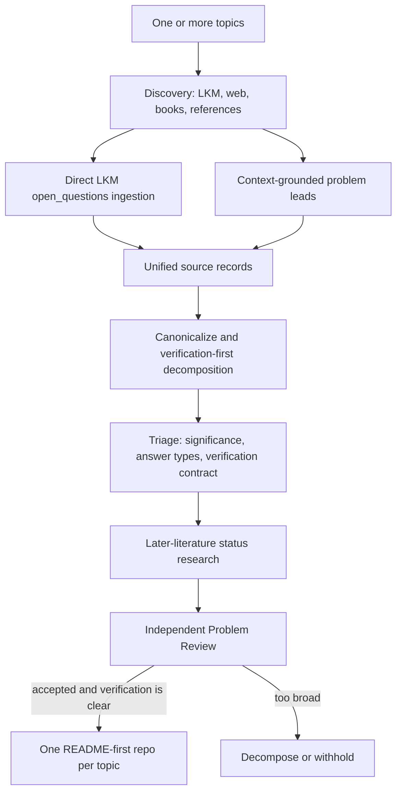

# Open Research Discovery

`open-research-discovery` turns one or more scientific topics into
source-grounded, currently open, independently reviewable research problems.

New schema-v2 campaigns are deliberately broader than the original LKM-only
workflow:

- explicit open questions can come from the dedicated Bohrium LKM paper graph;
- possible problems can be reconstructed from contextual LKM and web search,
  books, datasets, or user-supplied references;
- every source-derived problem must preserve the source's actual context and
  intent;
- broad themes are decomposed into concrete problems with unambiguous
  verification standards;
- answer types and verification difficulty are recorded, but neither is a
  publication gate;
- every problem receives a 0-10 scientific-significance score and rationale;
- all concrete problems under one topic compile into one README-first repository.

Benchmark building and evaluation remain separate explicit workflows. Ordinary
problem generation uses `discovery campaign`.

## First principles

An interesting question is not automatically a usable research problem. A final
problem must satisfy four independent conditions:

1. **Source fidelity** — the question follows from inspected evidence without
   quoting out of context or strengthening the original claim.
2. **Current openness** — later literature leaves a precise nonempty core, with
   the confidence and uncertainty recorded honestly.
3. **Scientific significance** — the repository states what knowledge,
   capability, bound, mechanism, experiment, or decision would change.
4. **Verification clarity** — an independent reviewer can tell exactly what is
   submitted, what is checked, under which scope or protocol, and what passes.

“Determine the Hubbard-model phase diagram” may be an important research theme,
but it is not yet a final problem: the model variant, parameter regime,
observables, thermodynamic or finite-size target, and acceptance conditions are
not pinned. The pipeline must split such a theme into meaningful checkable
subproblems or withhold it.

## Source routes

Each topic enables one or both routes.

### `lkm_open_questions`

Discovery finds candidate papers. The deterministic pipeline then calls the
direct LKM paper-graph API and preserves the raw response and `trace_id`. Only

```text
data.papers[].open_questions[]
```

is treated as an explicit source open-question record. Ordinary LKM
`question`, `problem`, `subproblem`, motivation, and variable nodes remain paper
or evidence leads.

In schema v2, each selected paper must also have abstract-level-or-better
evidence, a context summary, and a statement of source intent. The dedicated
open-question sentence is never interpreted in isolation from the paper's
model, assumptions, and scope.

### `topic_search`

Discovery searches LKM and the web adaptively and may inspect books or
user-supplied references. Each proposed lead must contain:

- a stable source identity and locator;
- a verbatim excerpt;
- enough surrounding context to disambiguate the excerpt;
- the source author's actual intent;
- a precise explanation of how the possible research question follows;
- honest content-level labels and evidence relations;
- descriptive possible answer types.

A topic-search lead is not presented as an explicitly declared open question.
Later-literature research must establish whether the reconstructed core is
currently open.

## Workflow



The agent stages return schema-validated artifacts and never mutate the pool.
The deterministic pipeline owns identifiers, caching, retries, compilation,
pool synchronization, and ranking.

## Quick start

Create a schema-v2 campaign from one or more topics:

```bash
uv run discovery campaign init \
  --topic "Hubbard model" \
  --topic "quantum thermalization" \
  --out campaign.yaml
```

Both source routes are enabled by default. They may be selected explicitly:

```bash
uv run discovery campaign init \
  --topic "protein folding dynamics" \
  --source lkm_open_questions \
  --source topic_search \
  --out campaign.yaml
```

Inspect the generated YAML, add seed papers or references when useful, then run:

```bash
uv run discovery campaign run campaign.yaml
```

Resume or inspect a run:

```bash
uv run discovery campaign resume /path/to/run
uv run discovery campaign status /path/to/run
```

Remote repository creation or push is never automatic; it requires explicit
authorization.

## Schema-v2 configuration

```yaml
schema_version: 2
name: quantum-many-body-open-problems

topics:
  - id: quantum-many-body
    title: Quantum Many-Body Physics
    query: >-
      Find source-faithful, currently open, independently verifiable research
      problems in quantum many-body physics.
    repo_slug: quantum-many-body-open-problems
    sources:
      - lkm_open_questions
      - topic_search
    seed_papers: []
    seed_references:
      - kind: book
        title: 10000 Scientific Problems — Physics Volume
        identifier: private-reference
        url: ''
        locator: relevant chapter
        excerpt: ''

limits:
  papers_per_domain: 10
  questions_per_domain: 100
  leads_per_topic: 100
  lkm_timeout_seconds: 60

agents:
  model: ''
  codex_executable: codex
  networked_sandbox: workspace-write
  network_access: true
  workers: 3
  networked_workers: 2
  retries: 1
  retry_backoff_seconds: 5
  sandbox: read-only
  timeout_seconds: 3600

outputs:
  runs_root: ./work/runs
  problem_root: ./work/problems
  pool_root: ./work/problem-pool
```

`max_verification_difficulty` is intentionally absent. Schema-v2 campaigns
always record verification difficulty from 0 to 10, but never use it as a
publication threshold. Schema-v1 campaigns and frozen benchmarks retain their
historical threshold semantics only for reproducibility.

## Context and canonicalization contract

Before formulating a problem, the pipeline must have enough context to identify:

- the source's object, assumptions, population, or physical regime;
- relevant definitions, observables, data, baselines, or conventions;
- what prior work established and what it did not establish;
- whether the source is asking a question, stating a limitation, motivating a
  direction, or merely describing adjacent work;
- how the proposed research problem follows without changing scope.

Canonicalization merges equivalent formulations and splits broad programs. Each
atomic candidate records its parent topic, source-specific excerpts, descriptive
answer types, a preliminary verification plan, and a decomposition rationale.

## Verification contract

Every final problem has:

- `verification_clarity: clear`;
- a concrete `verification_standard`;
- a result-focused review checklist;
- an acceptance boundary and explicit out-of-scope claims;
- `verification_difficulty` from 0 to 10;
- optional scientifically meaningful CI.

The score measures residual independent-review burden, not solve difficulty:

- `0`: pinned mechanical checks, replay, or certificates discharge every
  load-bearing claim;
- `1-3`: a few independent local reasoning units remain;
- `4-6`: connected derivations or substantial specification reconstruction;
- `7-9`: long, fragile, or novel reasoning chains;
- `10`: the essential claim cannot be decomposed into independent checks.

A score of 10 is not a rejection. An unclear verification standard is.

If clarity is `needs_decomposition`, the record must propose concrete
subproblems, each with its own question, answer types, standard, and rationale.
The pipeline does not make a vague theme appear verifiable by inventing a proxy
benchmark, arbitrary numerical threshold, or favorable finite instance.

## Answer types

Answer types describe what a scientifically meaningful submission may contain.
Examples include:

- proof or counterexample;
- exact solution or explicit construction;
- simulation or numerical result with a pinned model and protocol;
- experiment or measurement with declared observables and uncertainty;
- dataset or benchmark result when the scientific target is genuinely a fixed
  dataset or benchmark;
- classification, bound, algorithm, mechanism, or validated explanatory model.

They do not rank or gate problems and do not prescribe a method.

## Scientific significance

Every candidate and final problem receives a `scientific_significance_score`
from 0 to 10 plus a rationale. The rationale must be specific: it should say
what accepted knowledge or capability changes, who or what line of work depends
on it, and whether the contribution resolves a bottleneck, distinguishes
mechanisms, opens a regime, changes a bound, or enables a new measurement or
computation.

Ranking prioritizes current-open status and scientific significance.
Verification difficulty remains visible as reviewer workload and a secondary
scheduling signal, never as a proxy for scientific value.

## Topic repository contract

Schema-v2 compilation creates one repository per topic:

```text
quantum-many-body-open-problems/
  README.md
  .git/
```

Each concrete problem receives a stable `ORP-*` ID. The topic README contains:

1. topic overview and source routes;
2. a problem index;
3. for each problem:
   - origin, minimal exact source excerpt, preserved source intent, and
     sufficient context;
   - precise question and scope;
   - 0-10 scientific-significance score and analysis;
   - current progress and surviving open core;
   - expected result and descriptive answer types;
   - verification standard, checklist, boundary, and difficulty score;
   - source trail and references;
4. repository update and scope policy.

Raw retrieval responses, structured manifests, audit evidence, and pool views
remain outside the generated repository. Problem-specific code, data, or CI may
be added later only when its scientific acceptance contract needs them.

## Run artifacts

Schema-v2 runs preserve:

```text
campaign.yaml
state.json
source-records.json
canonicalization.json
ranking.json
domains/<topic-id>/
  source-papers.json
  source-records.json
  evidence/
candidates/<candidate-id>/
  source-records.json
  canonicalization.json
  triage.json
  assessment.json
  problem-review-verdict.json
  problem.yaml
topics/<topic-id>/
  compile.json
```

The dedicated LKM route also keeps each raw paper-graph response and extraction.

## Benchmark workflow

Benchmark construction and evaluation are separate from ordinary problem
generation:

```bash
uv run discovery benchmark build campaign.yaml
uv run discovery benchmark evaluate DATASET --out predictions
uv run discovery benchmark score --predictions predictions --gold gold
```

Frozen schema-v1 benchmark datasets may retain the historical verification
threshold as part of their evaluation label. That legacy label must not leak
back into schema-v2 problem publication.

## Development

```bash
uv run pytest
make check
```

The most important regression boundaries are:

- strict direct-LKM extraction remains strict;
- topic-search leads require exact context and honest provenance;
- source context survives canonicalization and review;
- broad questions cannot compile without clear verification;
- verification difficulty never gates schema-v2 publication;
- one topic compiles into one repository containing all accepted problems;
- benchmark commands remain separate from the default campaign workflow.
