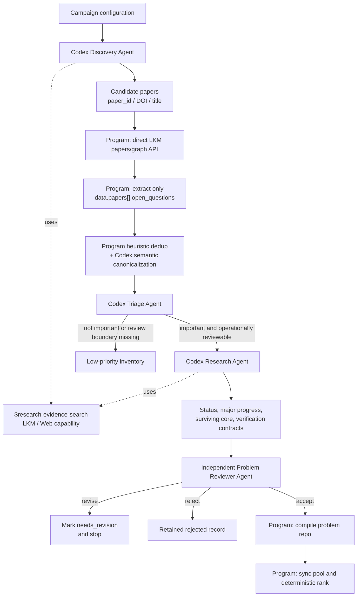

# Discovery pipeline

The pipeline is a deterministic state machine around a few coarse-grained
headless Codex roles. Programs own control flow, provenance, schemas, retries,
IDs, compilation, synchronization, and ranking. Agents own the scientific
judgments that cannot be reduced to a stable rule.



`$research-evidence-search` is a capability, not a data-flow or state node.
Discovery uses it to find papers. Research uses it to reconstruct later
evidence. After Research searches, its output goes directly to the structured
assessment and Problem Reviewer; it never returns to Discovery.

## Two LKM boundaries

Source-question ingestion and evidence search have different trust contracts.

### Strict source-question ingestion

For every candidate paper, the program sends:

```http
POST https://open.bohrium.com/openapi/v1/lkm/papers/graph
accessKey: ...
Content-Type: application/json
```

The JSON body contains exactly one of `paper_id`, `doi`, or `title`. The
program requires response-body `code == 0`, preserves the raw response and
`trace_id`, and reads only:

```text
data.papers[].open_questions[]
```

It keeps each item's `content`, `id`, and `global_id`, plus its paper ID,
title, DOI, and the exact source path. Ordinary question, problem, subproblem,
motivation, and graph nodes cannot create candidates.

### Research evidence retrieval

Discovery and Research agents may use the web and Gaia CLI in any useful
order. Common Gaia commands are:

```text
gaia search lkm knowledge
gaia search lkm reasoning
gaia search lkm nodes
gaia search lkm package
```

LKM provides metadata and abstracts as well as compressed conclusion claims
and reasoning chains. The web may provide metadata, abstracts, preprints, and
partial or complete accessible text. Evidence therefore carries one honest
content-level label:

```text
metadata | abstract | compressed_claim | reasoning_chain |
partial_full_text | full_text
```

Retrieval rank is never treated as confidence. Search results from ordinary
LKM question nodes are evidence leads, not source open questions.

Gaia question scope is mixed and may return `problem`, `subproblem`,
`question`, and `open_question` provenance. Even an `::open_question` hit is
only a paper lead until the direct paper-graph endpoint confirms it under
`data.papers[].open_questions`. A nonzero LKM business code is a failed lookup,
not an empty extraction; the collector preserves it and retries the paper by
paper ID, DOI, then exact title.

Discovery and Research run as headless Codex roles in an isolated
`workspace-write` sandbox with network access enabled so Gaia CLI can reach
LKM. Canonicalization, Triage, and Problem Reviewer stay in the configured
non-networked `read-only` sandbox. No role uses `danger-full-access`.

## Agent contracts

The Discovery Agent returns only candidate papers. The Triage Agent evaluates
intrinsic scientific importance and the boundary/cost of independent review;
it must not rank on solve difficulty, searchability, expected runtime to find
an answer, or probability of success.

The Research Agent directly returns:

- current status and confidence;
- what later literature does to the same core;
- major-progress classification;
- a precise surviving open core;
- post-progress importance;
- expected final result;
- future Solution Review scope, ordered post-solution checklist, and time
  estimate;
- problem-specific CI code or pseudocode, runner, runtime, and timeout;
- source-tagged evidence.

The independent Problem Reviewer checks those problem-construction judgments.
It writes one report and verdict. `accept` permits compilation, `revise` marks
the candidate `needs_revision`, and `reject` stops it. There is no automatic
Research-Reviewer loop and the pipeline never asks Discovery to repair a status
or verification assessment. A later pass is an explicit
`discovery case retry <run> <candidate> research`, so rerunning is an explicit
operator decision rather than Reviewer control flow. The generated checklist
is not used to review the problem; it is the instruction later consumed by a
separate Solution Reviewer after a solver submits a result.

## Screening benchmark construction

The screening benchmark evaluates an agent's judgments, not its ability to
solve the research problem. Preserve all canonical candidates, including
predicted failures and boundary cases. Generate one baseline prediction for
every candidate before commissioning expensive later-literature research:

```bash
uv run discovery benchmark predict <campaign-run-directory> --workers 3
```

This writes `benchmark-triage-summary.json` and per-candidate `triage.json`
files. These are model predictions, not gold labels. Stratify the benchmark
from passes, failures, and disagreements; then independently adjudicate the
selected cases. Do not allow the same agent output to serve as both prediction
and gold.

Workers write disjoint candidate artifacts. One in-process StageLedger
serializes atomic state-file replacements, so bounded parallel headless Codex
execution preserves one resumable `state.json`. Do not run two mutating CLI
commands against the same campaign directory at once.
For a full campaign, `agents.workers` in `campaign.yaml` bounds the independent
Triage fan-out. Research and its Problem Review remain sequential per
candidate because the review consumes the Research evidence.

Canonicalization atomizes explicitly separable targets from one source
`open_questions` record and preserves a candidate-specific exact excerpt.
Triage records only importance, the expected result, future Solution Review
scope and rationale, plus optional CI information. It does not propose how to
solve the problem.

The LLM makes the semantic review-scope judgment from the exact source
question and expected result. Its rationale must explain why the result
genuinely answers the question, any limitations, and whether review must
substantively assess a derivation rather than only the final answer or
artifact. These are semantic checks, not separate schema fields.

For `result-only`, ask one question: without reviewing the solver's reasoning
process, can an independent Reviewer basically decide correctness from only
the final result naturally required by the original problem? An ordinary
written proof remains `result-and-derivation`; executable formal proof code
counts as the result only when requested by the original problem. Do not add
an unrequested proof certificate or file format merely to change that label.
Executable CI is a separate bonus and does not by itself make a result
`result-only`.

## State and recovery

Each run has this external, pool-compatible layout:

```text
campaigns/<run-id>/
  campaign.yaml
  state.json
  source-open-questions.json
  canonicalization.json
  low-priority.json
  ranking.json
  domains/<domain-id>/
    source-papers.json
    source-open-questions.json
    evidence/lkm/
    events/
  candidates/<candidate-id>/
    source-papers.json
    source-open-questions.json
    canonicalization.json
    triage.json
    assessment.json
    problem-review-verdict.json
    compile.json
    events/
```

`state.json` stores each stage's input and output hashes, schema and skill
hashes, prompt/model/tool metadata, attempt, timestamps, exit code, artifact
paths, and failure. Resume reuses a stage only when its recorded input and
output still match. A targeted retry invalidates the selected candidate stage
and its downstream stages.

## Deterministic completion

Agents never write the corpus. After schema validation and Problem Reviewer
acceptance, the program compiles `problem.yaml`, source evidence, the future
Solution Reviewer checklist, and CI pseudocode into one problem repository. It
validates the repository, synchronizes the explicitly configured companion
pool, and applies the deterministic ranking policy.

The `research-ready` lane requires current-open status, high or medium
importance, and `result-only` review. The label is invalid unless its rationale
shows that the expected result faithfully answers the surviving core. CI does
not gate admission. Within otherwise equal problems, its availability and
latency are ranking bonuses; an implemented checker is required only for
automatic machine acceptance.
