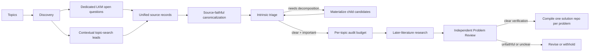

# Discovery Pipeline

This document specifies the schema-v2 problem-generation path. Schema-v1 is
retained only for compatibility with existing campaigns and frozen benchmarks.

## Lifecycle



## 1. Topic input

Each topic has a stable ID, title, query, enabled source routes, optional seed
papers, and optional books or other references. Multiple
topics may run concurrently. Completion order never changes deterministic
merge or problem-ID order.

## 2. Discovery and source ingestion

### Dedicated LKM route

Discovery returns paper identifiers. The deterministic pipeline calls the
direct paper-graph endpoint, requires response-body `code == 0`, preserves raw
responses and identifier attempts, and ingests only
`data.papers[].open_questions`. Every schema-v2 paper candidate also carries an
abstract-level-or-better context summary and source intent, so canonicalization
does not interpret the dedicated question sentence in isolation.
The dedicated field proves LKM provenance, not verbatim author attribution;
Research checks the extracted formulation against accessible paper text before
the final repository describes who posed it.

### Topic-search route

Discovery may search LKM and the web or inspect configured references. A lead
must include a verbatim excerpt, surrounding context, source intent, derivation
rationale, source metadata, and evidence-level labels. The exact excerpt must
be a substring of the preserved context. A lead is not marked as an explicit
open question.

Both routes become unified `source_records`. Each retains its source kind and
whether openness was explicitly declared.

## 3. Context fidelity and canonicalization

Canonicalization consumes the complete source record, not a search snippet.
For inferred leads it must inspect the excerpt, context, intent, and derivation
together. It may merge equivalent formulations, but not related questions.

The stage is source-faithful first. It preserves the natural generality,
objects, assumptions, and quantifiers of the literature problem. It does not
add finite-size, parameter, geometry, method, or answer-form restrictions to
make verification easier. Genuinely conjunctive source questions may be split
along source-supported boundaries; a restricted special case remains a named
derived problem and never replaces its parent. Famous or named problems use a
primary or standard authoritative formulation. Each candidate records a parent
theme, descriptive answer types, verification plan, and formulation rationale.
Candidate-specific excerpts are checked against the preserved source text.
The pipeline derives each cluster's `topic_id` from its source records and
rejects cross-topic clusters. A narrower method or theme belongs in
`parent_theme`; it never creates a new repository container.

## 4. Intrinsic triage

Triage evaluates the source-era problem before the expensive status audit. It
records:

- coarse importance plus scientific significance from 0 to 10;
- a specific significance rationale;
- expected result and descriptive answer types;
- verification clarity and concrete standard;
- optional proposed subproblems;
- verification difficulty from 0 to 10;
- CI status independently.

When triage returns `needs_decomposition`, the deterministic pipeline may turn
source-supported components into child candidates, preserves the parent's
complete source trail, and triages the children again up to the configured
depth. A convenient restricted instance is not a valid decomposition of a
general question. Only
high- or medium-importance candidates with a clear verification contract
proceed to later-literature research. An optional per-topic audit budget ranks
those clear candidates by scientific significance and coarse importance.
Verification difficulty never blocks that audit and never gates schema-v2
publication.

## 5. Research and Problem Review

Research searches LKM and the web adaptively for closure, refutation, special
cases, improved bounds, reformulations, and continuing treatment of the same
core. It must distinguish direct support from inference and may not use a new
agent-created solution as literature evidence.

When later work changes the core, Research re-scores significance and
verification from scratch. The Problem Reviewer independently checks source
fidelity, authoritative alignment for famous problems, absence of artificial
restrictions, context sufficiency, status, significance, answer types,
verification clarity and standard, score calibration, and evidence honesty.

Publication requires:

```text
current open core
AND high or medium importance
AND verification_clarity == clear
AND nonempty verification_standard
AND independent reviewer acceptance
```

There is deliberately no `verification_difficulty <= threshold` clause.

## 6. Solution-repository compilation

The compiler allocates a stable ORP ID and writes one README-first solution
repository for every accepted problem. `topic_id` remains grouping metadata, so
related repositories can be indexed together without forcing different
questions into a shared specification. Every README has exactly seven ordered
top-level sections: Background, Problem Statement, Scientific Significance,
Answer Types, Verification Standard, Current Progress, and References. It also
preserves the exact supporting excerpt and the dated literature audit. Internal
YAML records remain in campaign and pool storage.

Compilation is deterministic and refuses to overwrite an untracked or manually
modified solution repository. Each accepted problem receives its own Git
history, so updating one question cannot change a sibling's scientific contract.
The orchestrator first reserves ORP IDs in stable candidate order, then compiles
the independent solution repositories in parallel. Worker completion order never
changes the ID or summary order. Pool synchronization remains a serial barrier
after every compile worker has finished.

## 7. Pool and ranking

The pool retains one structured record per ORP. `topic_id` groups related
solution repositories without making them share a README or acceptance contract.

Ranking prioritizes:

1. current-open status;
2. scientific significance;
3. coarse importance;
4. verification difficulty and CI as secondary reviewer/scheduling metadata.

No ranking rule may treat easy verification as scientific value.

## 8. Reliability

The ledger hashes inputs, prompts, schemas, skills, and outputs. Cached stages
are reused only when their inputs match. Agent retries clear stale structured
output before invocation. Timeout handling terminates the whole process group.
An exclusive, same-thread-reentrant file lock serializes `run`, `resume`, and
`retry` mutations for one run directory across processes; a process that waited
for the lock refreshes newer on-disk state before writing. Parallel discovery,
triage, audit, depth-frontier decomposition, and solution compilation outputs
merge in configured order.
The summary separately reports canonical candidates, active decomposition
leaves, generated children, and candidates deferred by the audit budget.

## 9. Benchmark separation

`discovery benchmark ...` is an explicit dataset/evaluation workflow. It is
never a prerequisite for `discovery campaign run`. Frozen schema-v1 benchmarks
may preserve their historical threshold labels for reproducibility; those
labels do not control schema-v2 publication.
