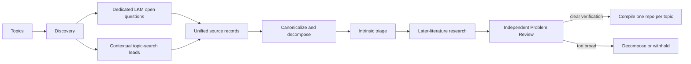

# Discovery Pipeline

This document specifies the schema-v2 problem-generation path. Schema-v1 is
retained only for compatibility with existing campaigns and frozen benchmarks.

## Lifecycle



## 1. Topic input

Each topic has a stable ID, title, query, repository slug, enabled source
routes, optional seed papers, and optional books or other references. Multiple
topics may run concurrently. Completion order never changes deterministic
merge or problem-ID order.

## 2. Discovery and source ingestion

### Dedicated LKM route

Discovery returns paper identifiers. The deterministic pipeline calls the
direct paper-graph endpoint, requires response-body `code == 0`, preserves raw
responses and identifier attempts, and ingests only
`data.papers[].open_questions`. Every schema-v2 paper candidate also carries an
abstract-level-or-better context summary and source intent, so canonicalization
does not interpret the dedicated question sentence in isolation.

### Topic-search route

Discovery may search LKM and the web or inspect configured references. A lead
must include a verbatim excerpt, surrounding context, source intent, derivation
rationale, source metadata, and evidence-level labels. The exact excerpt must
be a substring of the preserved context. A lead is not marked as an explicit
open question.

Both routes become unified `source_records`. Each retains its source kind and
whether openness was explicitly declared.

## 3. Context fidelity and canonicalization

Canonicalization consumes the complete source record, not a search snippet.
For inferred leads it must inspect the excerpt, context, intent, and derivation
together. It may merge equivalent formulations, but not related questions.

The stage is verification-first. Broad themes are split into concrete problems
with one independent acceptance target. Each candidate records a parent theme,
descriptive answer types, verification plan, and decomposition rationale.
Candidate-specific excerpts are checked against the preserved source text.

## 4. Intrinsic triage

Triage evaluates the source-era problem before the expensive status audit. It
records:

- coarse importance plus scientific significance from 0 to 10;
- a specific significance rationale;
- expected result and descriptive answer types;
- verification clarity and concrete standard;
- optional proposed subproblems;
- verification difficulty from 0 to 10;
- CI status independently.

High- and medium-importance candidates proceed to later-literature research.
Verification difficulty never blocks that audit and never gates schema-v2
publication.

## 5. Research and Problem Review

Research searches LKM and the web adaptively for closure, refutation, special
cases, improved bounds, reformulations, and continuing treatment of the same
core. It must distinguish direct support from inference and may not use a new
agent-created solution as literature evidence.

When later work changes the core, Research re-scores significance and
verification from scratch. The Problem Reviewer independently checks source
fidelity, context sufficiency, status, significance, answer types, verification
clarity and standard, score calibration, and evidence honesty.

Publication requires:

```text
current open core
AND high or medium importance
AND verification_clarity == clear
AND nonempty verification_standard
AND independent reviewer acceptance
```

There is deliberately no `verification_difficulty <= threshold` clause.

## 6. Topic compilation

Accepted candidates are grouped by `topic_id`. The compiler allocates stable
ORP IDs and writes one repository README per topic. That README carries the
complete narrative and acceptance contract for every problem, including the
minimal exact supporting excerpt, source intent, and preserved context needed
to audit formulation fidelity. Internal YAML records remain in campaign and
pool storage.

Topic compilation is deterministic and refuses to overwrite an untracked or
manually modified repository. One topic compile creates one Git commit. A later
reviewed retry recompiles the complete topic, so a single candidate update
cannot silently drop sibling problems.

## 7. Pool and ranking

The pool retains one structured record per concrete ORP even when several ORPs
share a topic repository. `repository.slug` preserves that many-to-one mapping.

Ranking prioritizes:

1. current-open status;
2. scientific significance;
3. coarse importance;
4. verification difficulty and CI as secondary reviewer/scheduling metadata.

No ranking rule may treat easy verification as scientific value.

## 8. Reliability

The ledger hashes inputs, prompts, schemas, skills, and outputs. Cached stages
are reused only when their inputs match. Agent retries clear stale structured
output before invocation. Timeout handling terminates the whole process group.
Parallel discovery, triage, and audit outputs merge in configured order.

## 9. Benchmark separation

`discovery benchmark ...` is an explicit dataset/evaluation workflow. It is
never a prerequisite for `discovery campaign run`. Frozen schema-v1 benchmarks
may preserve their historical threshold labels for reproducibility; those
labels do not control schema-v2 publication.
