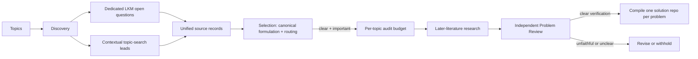

# Discovery Pipeline

This document specifies the problem-generation path.

## Lifecycle



## 1. Topic input

Each topic has a stable ID, title, query, enabled source routes, optional seed
papers, and optional books or other references. Multiple
topics may run concurrently. Completion order never changes deterministic
merge or problem-ID order.

Campaign execution defaults to 32 ordinary workers and 32 network-enabled
workers (hard cap 128). These are upper bounds: a stage with fewer independent
tasks uses only the available parallelism.

## 2. Discovery and source ingestion

### Dedicated LKM route

Discovery returns paper identifiers. The deterministic pipeline calls the
direct paper-graph endpoint, requires response-body `code == 0`, preserves raw
responses and identifier attempts, and ingests only
`data.papers[].open_questions`. Every paper candidate also carries an
abstract-level-or-better context summary and source intent, so selection
does not interpret the dedicated question sentence in isolation.
The dedicated field proves LKM provenance, not verbatim author attribution;
Research checks the extracted formulation against accessible paper text before
the final repository describes who posed it.

### Topic-search route

Discovery may search LKM and the web or inspect configured references. A lead
must include a verbatim excerpt, surrounding context, source intent, derivation
rationale, source metadata, and evidence-level labels. The exact excerpt must
be a substring of the preserved context. A lead is not marked as an explicit
open question.

Both routes become unified `source_records`. Each retains its source kind and
whether openness was explicitly declared.

## 3. Context fidelity and selection

Selection runs one agent call per topic over that topic's complete source
records — never a search snippet. For inferred leads it must inspect the
excerpt, context, intent, and derivation together. It may merge equivalent
formulations, but not related questions.

The stage is source-faithful first. It preserves the natural generality,
objects, assumptions, and quantifiers of the literature problem. It does not
add finite-size, parameter, geometry, method, or answer-form restrictions to
make verification easier. Genuinely conjunctive source questions may be split
along source-supported boundaries; a restricted special case remains a named
derived problem and never replaces its parent. Famous or named problems use a
primary or standard authoritative formulation. Each candidate records
descriptive answer types and its routing fields. Candidate-specific excerpts
are checked against the preserved source text, with a deterministic repair
pass for whitespace, case, and delimiter noise (`selection-repairs.json`).
The pipeline assigns each candidate's `topic_id` from the topic whose records
it cites; it never creates a new repository container.

Selection also routes: each candidate reports `importance_level`,
`verification_clarity`, `decomposition_parent_coverage`,
`proposed_subproblems`, and a free-form `assessment` narrative carried to
Research as context. Selection does **not** produce the verification contract:
`expected_result`, `verification_standard`, `verification_difficulty`, the
significance score, and the CI contract are all produced by the Research Agent
from scratch (the significance score is re-scored there and is the one
published).

The clarity/coverage conditional (empty subproblems for `clear`; at least one
with `complete` or `partial` coverage otherwise) is enforced by pipeline
validation, since agent structured output cannot express it. A convenient
restricted instance is not a valid decomposition of a general question. Only
high- or medium-importance candidates with `verification_clarity == clear`
proceed to later-literature research. An optional per-topic audit budget ranks
those clear candidates by coarse importance. Verification difficulty never
blocks that audit and never gates publication. A source lead no selected
candidate cites is retained in the persistent topic queue (section 5) instead
of being dropped, and so are the subproblems of every non-clear candidate.

## 4. Research and Problem Review

Research searches LKM and the web adaptively for closure, refutation, special
cases, improved bounds, reformulations, and continuing treatment of the same
core. It must distinguish direct support from inference and may not use a new
agent-created solution as literature evidence.

The Research stage returns one JSON object
(`schemas/stages/research.schema.json`) holding two artifacts plus
structured decomposition fields:

- `problem`: a problem draft whose nested sections (title, question,
  resolution_audit, importance, research_triage, discovery_contract,
  solution_review_contract, ci_contract) mirror
  `schemas/problem.schema.json` (schema v4). Every mechanical field — ids,
  status, schema_version, topic_id, repository, source records,
  `question.lineage`, the `progress_assessment` decision and
  reassessed flag, and the research_triage priority and route — is
  derived or injected by the
  deterministic pipeline and must not appear in the agent output.
- `report_markdown`: a free-form English audit narrative carrying what the
  earlier flat assessment called `literature_treatment` and
  `status_rationale` — the literature lineage, how later work treats the
  problem, the importance argument, and an explicit statement of search
  coverage and remaining uncertainty. The pipeline writes it to the candidate
  directory as `report.md` and shows it verbatim to the Problem Reviewer.
- `proposed_subproblems` and `decomposition_parent_coverage`: structured
  subproblem proposals conditional on `verification_clarity` exactly as in
  selection (section 3); every proposed subproblem enters the persistent topic
  queue (section 5).

The validated draft is stored as `candidates/<candidate-id>/research.json`.
A draft that fails a refinable structure check is repaired once, offline, by
the Refine Agent before the failure quarantines the candidate.

The progress decision is never an agent judgment. The pipeline derives it
mechanically from the audit's status, `major_progress_found`, `effect`, and a
mechanical formulation diff between the input candidate and the audited draft:

- no major progress: `continue` for a surviving open target (`still_open` or
  `partially_resolved`), `unassessed` for `uncertain` status, `stop` for
  `resolved` or `refuted`;
- major progress: `stop` when the target is resolved/refuted or the effect
  resolves/refutes it; `unassessed` when status or effect is `uncertain`; a
  contract error when the effect is `none`; otherwise `rewrite-core` when the
  formulation diff changed, `continue` when it did not.

The same mechanical diff flags a changed formulation for the publication gate
and the Problem Reviewer's `scope_change` check. When
later work changes the core, Research re-scores significance and verification
from scratch. The Problem Reviewer independently checks source fidelity,
authoritative alignment for famous problems, absence of artificial
restrictions, context sufficiency, status, significance, answer types,
verification clarity and standard, score calibration, and evidence honesty.

Publication requires:

```text
current open core
AND high or medium importance
AND verification_clarity == clear
AND nonempty verification_standard
AND independent reviewer acceptance
```

There is deliberately no `verification_difficulty <= threshold` clause.

A candidate that survives the audit but remains too general or unverifiable is
not discarded: its required `proposed_subproblems` flow back into the
persistent topic queue so a later campaign can pose the refined questions.

## 5. Persistent topic queue

Every run root retains `<runs_root>/topic-queue.jsonl`, one JSON
entry per line conforming to `schemas/topic-queue.schema.json`. The queue
implements three behavior rules:

1. Output follows the schema strictly. `verification_clarity: clear` requires
   an empty `proposed_subproblems` and `decomposition_parent_coverage:
   not_applicable`; `needs_decomposition` or `unverifiable` requires at least
   one subproblem and `complete` or `partial` coverage. Agent structured
   output cannot express such conditionals, so the deterministic pipeline
   enforces them after the agent returns.
2. Retention over rejection. `unverifiable` is not a terminal verdict: a
   literature-grounded scientific question that is not yet specific enough is
   decomposed into subproblems and queued, never silently dropped. The same
   holds for research-stage candidates that remain too general after the
   audit.
3. Lifecycle. The pipeline appends entries as `pending` with a stable
   `queue_id` (`q` plus 16 lowercase hex characters) and validates every entry
   against the schema when loading the queue. The next campaign for the topic
   replays pending entries into Selection as `queue:<queue_id>`
   source records — whose source text is the queued statement — and marks
   them `consumed`. Dedicated LKM `open_questions`
   records remain the highest-priority source; queued entries retain
   decomposition work across runs and never replace direct sources.

## 6. Solution-repository compilation

The compiler allocates a stable ORP ID and writes one README-first solution
repository for every accepted problem. `topic_id` remains grouping metadata, so
related repositories can be indexed together without forcing different
questions into a shared specification. Every README has exactly seven ordered
top-level sections: Background, Problem Statement, Scientific Significance,
Answer Types, Verification Standard, Current Progress, and References. It also
preserves the exact supporting excerpt and the dated literature audit. Internal
YAML records remain in campaign and pool storage.

Compilation is deterministic and refuses to overwrite an untracked or manually
modified solution repository. Each accepted problem receives its own Git
history, so updating one question cannot change a sibling's scientific contract.
The orchestrator first reserves ORP IDs in stable candidate order, then compiles
the independent solution repositories in parallel. Worker completion order never
changes the ID or summary order. Pool synchronization remains a serial barrier
after every compile worker has finished.

## 7. Pool and ranking

The pool retains one structured record per ORP. `topic_id` groups related
solution repositories without making them share a README or acceptance contract.

Ranking prioritizes:

1. current-open status;
2. scientific significance;
3. coarse importance;
4. verification difficulty and CI as secondary reviewer/scheduling metadata.

No ranking rule may treat easy verification as scientific value.

## 8. Reliability

The ledger hashes inputs, prompts, schemas, skills, and outputs. Cached stages
are reused only when their inputs match. Agent retries clear stale structured
output before invocation. Timeout handling terminates the whole process group.
Agent stages run through a configurable headless backend (`agents.backend`):
`codex` enforces the output schema via structured output inside an OS sandbox;
`kimi` (Kimi Code CLI headless mode) carries the schema in the prompt and
enforces it by post-hoc parsing and validation, with no sandbox — role
isolation then relies on environment sanitization alone. In both backends,
output-contract failures are never retried.
An exclusive, same-thread-reentrant file lock serializes `run`, `resume`, and
`retry` mutations for one run directory across processes; a process that waited
for the lock fails fast instead of writing over newer on-disk state. Parallel
discovery, selection, audit, and solution compilation outputs merge in
configured order.
The summary separately reports canonical candidates and candidates deferred by
the audit budget.

## 9. Benchmark separation

`discovery quality ...` is an explicit artifact-evaluation workflow. It is
never a prerequisite for `discovery campaign run`.
