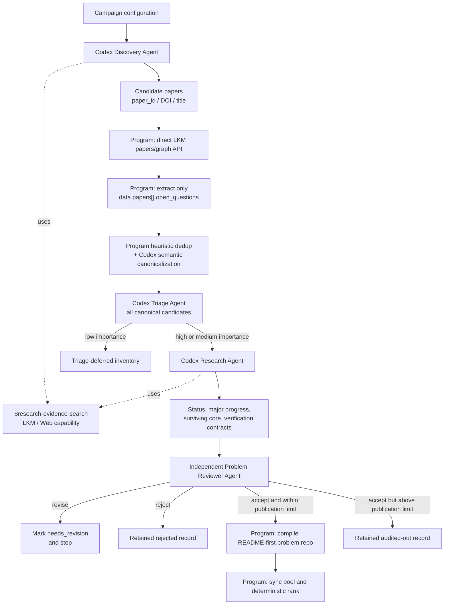

# Discovery pipeline

The pipeline is a deterministic state machine around a few coarse-grained
headless Codex roles. Programs own control flow, provenance, schemas, retries,
IDs, compilation, synchronization, and ranking. Agents own the scientific
judgments that cannot be reduced to a stable rule.



`$research-evidence-search` is a capability, not a data-flow or state node.
Discovery uses it to find papers. Research uses it to reconstruct later
evidence. After Research searches, its output goes directly to the structured
assessment and Problem Reviewer; it never returns to Discovery.

Every canonicalized candidate receives Triage. Triage determines intrinsic
importance and verification difficulty, but verification difficulty does not
control whether an important candidate receives the later-literature audit.
Only low-importance candidates stop before Research. The configured maximum
verification difficulty is applied after Research and independent Problem
Review when deciding whether to compile a problem repository.

## Two LKM boundaries

Source-question ingestion and evidence search have different trust contracts.

### Strict source-question ingestion

For every candidate paper, the program sends:

```http
POST https://open.bohrium.com/openapi/v1/lkm/papers/graph
accessKey: ...
Content-Type: application/json
```

The JSON body contains exactly one of `paper_id`, `doi`, or `title`. The
program requires response-body `code == 0`, preserves the raw response and
`trace_id`, and reads only:

```text
data.papers[].open_questions[]
```

It keeps each item's `content`, `id`, and `global_id`, plus its paper ID,
title, DOI, and the exact source path. Ordinary question, problem, subproblem,
motivation, and graph nodes cannot create candidates.

### Research evidence retrieval

Discovery and Research agents may use the web and Gaia CLI in any useful
order. Common Gaia commands are:

```text
gaia search lkm knowledge
gaia search lkm reasoning
gaia search lkm nodes
gaia search lkm package
```

LKM provides metadata and abstracts as well as compressed conclusion claims
and reasoning chains. The web may provide metadata, abstracts, preprints, and
partial or complete accessible text. Evidence therefore carries one honest
content-level label:

```text
metadata | abstract | compressed_claim | reasoning_chain |
partial_full_text | full_text
```

Retrieval rank is never treated as confidence. Search results from ordinary
LKM question nodes are evidence leads, not source open questions.

Gaia question scope is mixed and may return `problem`, `subproblem`,
`question`, and `open_question` provenance. Even an `::open_question` hit is
only a paper lead until the direct paper-graph endpoint confirms it under
`data.papers[].open_questions`. A nonzero LKM business code is a failed lookup,
not an empty extraction; the collector preserves it and retries the paper by
paper ID, DOI, then exact title.

Discovery and Research run as headless Codex roles in an isolated
`workspace-write` sandbox with network access enabled so Gaia CLI can reach
LKM. Canonicalization, Triage, and Problem Reviewer stay in the configured
non-networked `read-only` sandbox. No role uses
`danger-full-access`.

## Agent contracts

The Discovery Agent returns only candidate papers. The Triage Agent evaluates
intrinsic scientific importance and the boundary/cost of independent review;
it must not rank on solve difficulty, searchability, expected runtime to find
an answer, or probability of success.

The Research Agent directly returns:

- current status and confidence;
- what later literature does to the same core;
- major-progress classification;
- a precise surviving open core;
- post-progress importance;
- expected final result;
- verification difficulty, ordered post-solution checklist, and time
  estimate;
- problem-specific CI code or pseudocode, runner, runtime, and timeout;
- source-tagged evidence.

Research is a literature-status audit, not a solver stage. It must not create a
new proof, counterexample, construction, computation, or scientific
explanation and then count that output as evidence that the source problem is
closed. Resolution and major-progress claims require external research
evidence; an apparent elementary resolution is recorded only as a scope or
identity concern.

The independent Problem Reviewer checks those problem-construction judgments.
It writes one report and verdict. `accept` means the assessment is supported;
compilation additionally requires a nonempty open core, medium or high
importance, and verification difficulty within the campaign limit. Otherwise the candidate
is `audited_out`. `revise` marks the candidate `needs_revision`, and `reject`
stops it. There is no automatic
Research-Reviewer loop and the pipeline never asks Discovery to repair a status
or verification assessment. A later pass is an explicit
`discovery case retry <run> <candidate> research`, so rerunning is an explicit
operator decision rather than Reviewer control flow. The generated checklist
is not used to review the problem; it is the instruction later consumed by a
separate Solution Reviewer after a solver submits a result.

When several candidates need the same revision pass, defer each retry with
`discovery case retry <run> <candidate> research --defer`. A deferred retry
advances the applied-feedback snapshot, invalidates the stage chain, and
marks the candidate `retry_requested` without invoking an agent. The next
`discovery campaign resume` re-checks scientific importance for each deferred
candidate, records low-importance cases in `triage-deferred.json`, and executes
the high- or medium-importance retries inside the same parallel candidate
audit used by a normal run, applying the accumulated reviewer feedback to each
rerun.

Each distinct, pipeline-recorded `revise` verdict is persisted in
`problem-review-feedback-history.json`. Research retries receive the
deduplicated cumulative concerns and revision instructions from every prior
review round. Later `accept` or `reject` verdicts do not overwrite or extend
that history. The exact feedback consumed by the current assessment is stored
separately in `research-feedback-applied.json`: ordinary resume and
Problem-Review-only retry reuse that snapshot within a v9 campaign, while an
explicit retry that invalidates Research (`triage` or `research`) advances it
to all feedback currently in the history. Its hash is stored in `state.json`,
so a missing or modified snapshot fails closed.

For campaigns created before pipeline v9, automatic recovery can import only
the latest verdict artifact whose completed stage record and SHA still match.
If upgrading invalidates Research, the recovered feedback is applied to that
migration run. Earlier verdicts already overwritten by an older pipeline
cannot be reconstructed automatically; re-audit them or add reviewed history
entries with source `manual-seed`, unique IDs, string-list
concerns/instructions, and attempt `0`.
Campaign artifacts are trusted local state rather than a tamper-evident log;
manual recovery entries must not be relabeled as `problem-review`.

## Screening benchmark construction

The screening benchmark evaluates an agent's judgments, not its ability to
solve the research problem. Preserve all canonical candidates, including
predicted failures and boundary cases. Generate one baseline prediction for
every candidate before commissioning expensive later-literature research:

```bash
uv run discovery benchmark predict <campaign-run-directory> --workers 3
```

This writes `benchmark-triage-summary.json` and per-candidate `triage.json`
files. These are model predictions, not gold labels. Stratify the benchmark
from passes, failures, and disagreements; then independently adjudicate the
selected cases. Do not allow the same agent output to serve as both prediction
and gold.

Workers write disjoint candidate artifacts. One in-process StageLedger
serializes atomic state-file replacements, so bounded parallel headless Codex
execution preserves one resumable `state.json`. Do not run two mutating CLI
commands against the same campaign directory at once. Separate campaign
processes may share one `problem_root`: problem-ID allocation takes an
exclusive `flock` on `problem_root/.id-allocation.lock` covering the used-ID
scan, the reserving `mkdir` of the `ORP-NNNN-slug` directory, and the state
update. The reserved directory counts as used even while it is still empty.
If a run crashes after reserving or partially building a repository, the next
run of the same campaign removes the recorded partial repository and rebuilds
it; an existing repository directory the run never recorded still fails
closed instead of being overwritten.
For a full campaign, `agents.workers` in `campaign.yaml` bounds every
parallel region: domain-level Discovery, the independent Triage fan-out,
and the number of concurrent candidate audit
chains. Each audit chain remains internally sequential because Problem Review
consumes that candidate's Research evidence. Domain-parallel stages write
only domain-scoped artifacts and ledger keys, and their outputs merge in
configured domain order, so completion timing cannot change the merged
result. A failed agent invocation is retried up to `agents.retries` times
with exponential backoff (`agents.retry_backoff_seconds * 2^attempt`);
structured-output contract failures are deterministic rejections and are
never retried. Networked roles (Discovery, Research) across all regions share
one semaphore capped by `agents.networked_workers` (default:
`agents.workers`); non-networked roles are not throttled. All chains join
before problem-ID allocation, compilation, pool synchronization, and
ranking; those steps run serially in canonical candidate order and are
independent of worker completion timing.

Canonicalization atomizes explicitly separable targets from one source
`open_questions` record and preserves a candidate-specific exact excerpt.
When an excerpt is not an exact substring of its source record, a
programmatic check attempts a controlled repair: it aligns the excerpt to
the uniquely best-matching source window (similarity at least 0.98) and,
only if every difference is whitelisted transcription noise (first-letter
case, added or removed LaTeX `$` delimiters, outer whitespace, Unicode
whitespace/dash equivalents), substitutes the verbatim source span and
records the before/after pair in `canonicalization-repairs.json`. Anything
else — fabricated, paraphrased, or ambiguous excerpts — still fails
closed with a validation error.
Triage records only importance, the expected result, verification difficulty
and rationale, plus optional CI information. It does not propose how to
solve the problem.

The LLM assigns an integer from 0 to 10 from the exact question and expected
result. The score is the residual verification burden left after every
mechanically delegable check has been delegated. Zero means all load-bearing
claims are discharged by mechanical checks, replay, or certificates with
trivial specification fidelity; it does not require CI. Scores 1–9 represent
increasing residual derivation review, and an essential claim that cannot be
decomposed into independently checkable units is 10. Explicit counterexamples,
exact solutions, finite constructions, fixed code-to-experiment comparisons,
and required proof-assistant artifacts with contract-pinned statements can
all be 0. CI is a separate operational layer: it records how much of the
delegable checking has been automated and cannot lower the structural score.

## State and recovery

Each run has this external, pool-compatible layout:

```text
campaigns/<run-id>/
  campaign.yaml
  state.json
  source-open-questions.json
  canonicalization.json
  canonicalization-repairs.json
  triage-deferred.json
  benchmark-triage-summary.json
  ranking.json
  domains/<domain-id>/
    source-papers.agent.json
    source-papers.json
    source-open-questions.json
    evidence/lkm/
    events/
  candidates/<candidate-id>/
    source-papers.json
    source-open-questions.json
    canonicalization.json
    triage.json
    assessment.json
    research-feedback-applied.json
    problem-review-verdict.json
    problem-review-feedback-history.json
    compile.json
    problem.yaml
    evidence/lkm/research-evidence.json
    evidence/web/research-evidence.json
    events/
```

`state.json` stores each stage's input and output hashes, schema and skill
hashes, prompt/model/tool metadata, attempt, timestamps, exit code, artifact
paths, and failure. Resume reuses a stage only when its recorded input and
output still match. A targeted retry invalidates the selected candidate stage
and its downstream stages.

## Deterministic completion

Agents never write the corpus. After schema validation and Problem Reviewer
acceptance, the program keeps the structured record and evidence in the
campaign/pool, then renders one canonical, entirely English `README.md` into
the problem repository. Verification difficulty, meaningful CI ideas, current
status, LKM provenance, and annotated citations live in that narrative.
Formulas use GitLab-compatible `$...$` and `$$...$$` delimiters. A problem
repository may also contain `README.zh-CN.md` as a faithful Chinese
translation; it is not a second scientific specification and must not change
the English README's scope. The compiler does not copy a
schema, manifest, reviewer configuration, or structural-only CI into the
research repository. It validates the README, synchronizes the explicitly
configured companion pool, and applies the deterministic ranking policy.

The separation is intentional: structured records are useful for discovery,
deduplication, ranking, and resumability; the research repository is the
versioned scientific problem that people and solving agents actually read.
Optional `.gitlab-ci.yml`, `verify/`, `examples/`, or `data/` are added only
when the specific problem genuinely needs them.

The `research-ready` lane requires current-open status, high or medium
importance, and a score no greater than `limits.max_verification_difficulty`
(default 3). The score is invalid unless its rationale shows that the expected
result faithfully answers the surviving core. CI does
not gate admission. Within otherwise equal problems, its availability and
latency are ranking bonuses; an implemented checker is required only for
automatic machine acceptance.
