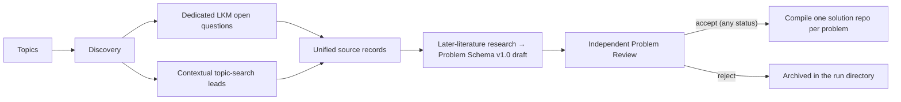

# Discovery Pipeline

This document specifies the problem-generation path.

## Lifecycle



The flow is one-directional: no revision loops, no reviewer feedback rounds,
no cross-campaign re-issuance. Stage context travels through pipeline-written
`memory.md` files — one per topic and one per candidate. Every agent's world
is a folder prepared for it: Discovery runs in the topic directory and chooses
the bounded Research handoff, Research runs in the candidate directory, and the
Problem Reviewer in a copied `review-workdir/`. Naming convention: pipeline
memory is always `memory.md`; agent-written notes are `<role>-memory.md`
(`research-memory.md`, `review-memory.md`).

## 1. Topic input

Each topic has a stable ID, title, query, enabled source routes, optional seed
papers, and optional books or other references. Multiple
topics may run concurrently. Completion order never changes deterministic
merge or problem-ID order.

Campaign execution defaults to 32 network-enabled agent calls (hard cap 128).
`topic_workers` separately bounds active topic pipelines and defaults to the
global worker limit. `candidate_workers_per_topic` bounds concurrent
Research-to-Review chains within each topic and defaults to 1. The global
worker semaphore caps the combined network concurrency, so a stage with fewer
independent tasks uses only the available parallelism.

## 2. Discovery and source ingestion

Discovery works exclusively against LKM: hybrid retrieval via the Gaia CLI
and the LKM paper graph. It never downloads papers or web pages; all
primary-source verification belongs to the Research stage.

### Dedicated LKM route

Discovery uses Gaia retrieval and paper graphs to choose specific
`data.papers[].open_questions` records (20 per topic by default). For each it
leaves a concise reason for the Research handoff. The deterministic pipeline
re-fetches its paper graph, requires response-body `code == 0`, preserves the
raw response, and verifies the selected `global_id` before creating a candidate
directory.
The dedicated field proves LKM provenance, not verbatim author attribution;
Research checks the extracted formulation against accessible paper text before
the final repository describes who posed it.

### Topic-search route

Discovery reconstructs potential research problems from LKM summaries. Each
`problem_summaries` entry carries a summary (what the problem is, why LKM
suggests it is open, the source context) and its LKM references (node or
paper identifiers with notes). A summary is a lead, not a verified
source-faithful formulation — LKM may misread the source.

Both routes become unified `source_records`: LKM records keep the verbatim
open-question text, topic-search records keep the summary and reference
list. Each retains its source kind.

## 3. Context fidelity and Discovery selection

Discovery is the only selection call. It works against LKM, keeps a bounded
set of concrete source questions, and records why each is worth research.
The pipeline makes one folder per selected source record containing
`discovery.json`, `lkm.json`, `source-records.json`, and `memory.md` before
Research begins. Discovery never verifies primary sources or current status.

The stage preserves the natural generality,
objects, assumptions, and quantifiers of the literature problem. It does not
add finite-size, parameter, geometry, method, or answer-form restrictions to
make verification easier. Genuinely conjunctive source questions may be split
along source-supported boundaries; a restricted special case remains a named
derived problem and never replaces its parent. Famous or named problems use a
primary or standard authoritative formulation quoted from the source context.
The pipeline assigns each candidate's `topic_id` from the topic whose records
it cites; it never creates a new repository container.

Every selected candidate proceeds to later-literature Research. Discovery does
not produce a verification contract; verification difficulty, significance, and
CI contracts are all produced by the Research Agent from scratch. A source lead
not selected is absent from the candidate set.

## 4. Research and Problem Review

The candidate's formulation comes from LKM summaries and paraphrases and may
misread the source, so Research first verifies source fidelity against
primary sources (downloading papers is allowed): the problem as stated must
be what the cited work actually asks, attribution must be correct, and LKM
must not have conflated adjacent results. A wrong paraphrase is corrected to
the primary source and recorded in `previous_progress`; a candidate built on
a misreading with no real underlying problem is reported `uncertain` with an
explanation. Only then does Research
search LKM and the web adaptively for closure, refutation, special
cases, improved bounds, reformulations, and continuing treatment of the same
core. It must distinguish direct support from inference and may not use a new
agent-created solution as literature evidence.

The Research stage returns one JSON object that validates directly against
`schemas/problem.schema.json` ([Problem Schema v1.0](problem-schema-v1.0.md))
plus one extra `audit_outcome` field (`open` / `uncertain` / `resolved` /
`refuted`). Every mechanical field — `problem_id`, `parent_problem_id`,
`subproblem_ids`, `schema_version`, `status`, `domain`, `topic_id`,
`repository` — is injected by the deterministic pipeline during validation
(`status` derives from `audit_outcome`) and must not appear in the agent
output.

Problem-window review is holistic and does not add schema fields. Research
must make the common scientific objective and the relationship among requested
results explicit. Several methods, deliverables, or potential papers may stay
in one problem when they are scientifically linked and jointly support that
objective. Independent publishability, the ability to remove one useful
component, and relative language such as "substantially larger" are prompts for
closer review, not automatic split or rejection rules. Such language is
acceptable when inspected sources, context, or field conventions make it
sufficiently determinate for a qualified domain expert; Research must not
invent arbitrary thresholds merely to make it mechanical.

The Research Agent's world is the candidate directory. The validated draft is
stored as `candidates/<candidate-id>/research.json`, a summary of the audit
outcome is appended to the candidate's `memory.md`, and the agent's own audit
notes (retrieval routes, key evidence, open-core reasoning, uncertainty) are
expected as `research-memory.md` in the same directory — a missing notes file
is a warning in the stage events, never a stage failure. A candidate whose
research stage fails is quarantined as `research_failed` without aborting the
run; a plain resume re-runs it because the failed stage left no ledger cache.

The pipeline then copies the whole candidate folder (minus `events/` logs) to
`candidates/<candidate-id>/review-workdir/` and runs a deterministic citation
pre-check: every identifier in the research record is resolved against
arXiv/Crossref/web metadata (via the quality benchmark's `EvidenceFetcher`
with a shared on-disk cache at `<run_dir>/.citation-cache`), and the
verdicts — `ok`, `mismatch`, `unresolvable`, `no-identifier`, plus an
`author-mismatch` flag — are written to `review-workdir/possible-bugs.md`.
Fetch failures degrade to `unresolvable` and never abort the stage. The
Problem Reviewer sees
only that copy. It is an editing review with LKM and web access: the reviewer
must process every flagged entry in `possible-bugs.md` (fix the citation
online, or justify the flag in `concerns`),
verifies the literature and citations online, fixes formatting, makes
`problem_statement` self-contained and unambiguous (every definition, symbol,
quantifier, and scope boundary closes within the text), corrects reference
strings, and independently checks source fidelity, authoritative alignment for
famous problems, absence of artificial restrictions, status, significance,
the per-type verification and CI contracts, score calibration, and evidence
honesty. For problem-window defects, it rejects only when a qualified expert
would have to invent missing scope, ignore an unrelated requested result, or
accept a proxy or materially narrower target to decide that the overall
objective was met. Holistic expert review is valid and CI may cover only
auxiliary checks. It returns `candidate_id`, `verdict` (`accept` / `reject`),
`concerns`, and — when accepting — the full corrected problem record in
`problem` (null on reject), and it leaves its own review notes (what it
verified online, what it changed and why, any status change and its
evidence, remaining doubts) as `review-memory.md` in the copy — a missing
notes file is a warning in the stage events, never a failure, and a present
one is archived back into the candidate directory. The contract is materialized by the pipeline as
`schemas/problem-review.schema.json` inside the run directory for
schema-enforcing backends. The reviewer must stay source-faithful and must
not touch the pipeline-owned fields: any drift from the research record's
`problem_id`/`domain`/`topic_id`/`repository`/`schema_version`/
`parent_problem_id`/`subproblem_ids` is a contract failure, and the pipeline
re-injects the research record's values before validating the corrected
record against `schemas/problem.schema.json`. The single exception is
`status`: when online evidence shows the problem is settled or genuinely
unclear, the reviewer returns the full record with `status` set to
`resolved-externally`, `refuted-externally`, or `uncertain` and cites the
external evidence in `concerns` or `previous_progress` — an override without
cited evidence is a contract failure, and a settled problem must not be
rejected merely for being settled. Compilation uses the reviewed
record; the copy stays in `review-workdir/` for human inspection.

Publication requires exactly:

```text
reviewer verdict == accept
```

at any audited status: open and uncertain records join the active pool, and
externally resolved/refuted records compile too, landing in
`pool/resolved/`. There is deliberately no `verification_difficulty <=
threshold` clause and no separate clarity gate: contract quality is the
reviewer's judgment, recorded in `concerns`.

A candidate that does not reach publication is not re-issued: it stays
archived in its run directory with its source records, Discovery summary,
research draft, review verdict, and the full `memory.md` context trail.

## 5. Solution-repository compilation

The compiler allocates a stable ORP ID and writes one README-first solution
repository for every accepted problem. `topic_id` remains grouping metadata, so
related repositories can be indexed together without forcing different
questions into a shared specification. Every README has exactly eight ordered
top-level sections: Background, Problem Statement, Current Progress,
Scientific Significance, Answer Types, Verification Standard, Suggested CI,
and References,
projected deterministically from the Problem Schema v1.0 manifest. Internal
YAML records remain in campaign and pool storage.

Compilation is deterministic and refuses to overwrite an untracked or manually
modified solution repository. Each accepted problem receives its own Git
history, so updating one question cannot change a sibling's scientific contract.
The orchestrator first reserves ORP IDs in stable candidate order, then compiles
the independent solution repositories in parallel. Worker completion order never
changes the ID or summary order. Pool synchronization remains a serial barrier
after every compile worker has finished.

## 6. Pool and ranking

The pool retains one structured record per ORP. `topic_id` groups related
solution repositories without making them share a README or acceptance contract.
Snapshots split by status: active records (`ready`, `open`, `uncertain`) live
in `pool/problems/`, externally resolved/refuted records in `pool/resolved/`;
`catalog.jsonl` covers both and each record carries its `status` and
`snapshot` path.

Ranking orders by:

1. current-open status (`ready`/`open` first, then `uncertain`, then
   externally resolved/refuted — annotated `ranking_lane: resolved`);
2. affected-field significance level (high, medium, low);
3. verification difficulty as secondary reviewer-workload metadata.

No ranking rule may treat easy verification as scientific value.

## 7. Reliability

The ledger hashes inputs, prompts, schemas, skills, and outputs. Cached stages
are reused only when their inputs match. Agent invocation retries clear stale
structured output before invocation. Timeout handling terminates the whole
process group.
Agent stages run through a configurable headless backend (`agents.backend`):
`codex` enforces the output schema via structured output inside an OS sandbox;
`kimi` (Kimi Code CLI headless mode) carries the schema in the prompt and
enforces it by post-hoc parsing and validation, with no sandbox — role
isolation then relies on environment sanitization alone. In both backends,
output-contract failures are never retried at the campaign layer (the
prompt-schema backends get exactly one validation-feedback round inside the
runner with the concrete validator error).
An exclusive, same-thread-reentrant file lock serializes `run` and `resume`
for one run directory across processes; a process that waited
for the lock fails fast instead of writing over newer on-disk state. Parallel
discovery, audit, and solution compilation outputs merge in
configured order.
The summary separately reports Discovery candidates and quarantined failures.

## 8. Benchmark separation

`discovery quality ...` is an explicit artifact-evaluation workflow. It is
never a prerequisite for `discovery campaign run`.
