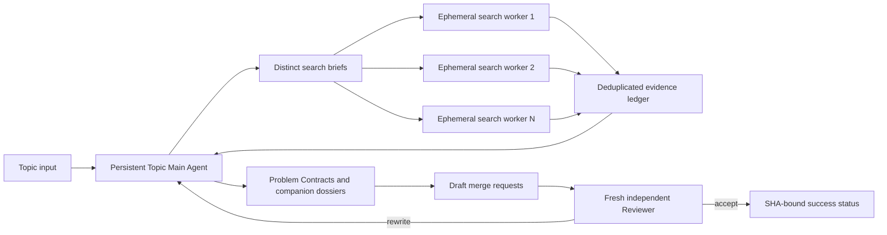

# Per-topic Agent and independent review workflow

This workflow is the default when one scientific topic should produce several
related Problem Contracts in one GitLab repository. It keeps the public
`problem.json` minimal while retaining enough evidence and Git state to audit
how each problem was constructed.

## Responsibility boundary



- One Topic Main Agent owns the scientific decomposition and final wording for
  one topic. Its exact Codex session UUID is persisted and resumed; the
  controller never uses `--last`.
- The main Agent creates distinct search briefs. The deterministic controller
  currently launches one ephemeral search Agent per brief in parallel. This
  controller-mediated fan-out keeps every result schema-valid and auditable;
  it can later be replaced by native subagent dispatch behind the same evidence
  ledger boundary.
- Search workers return evidence packets, not final questions. The ledger
  canonicalizes sources and evidence anchors, caches completed packets, and
  sends only new evidence to the resumed main Agent.
- Every generated `problem.json` has a separate companion evidence dossier.
  The dossier is review material, not part of the public Problem Schema.
- The Reviewer is a new headless Agent. It reads the exact contract and dossier
  blobs from the submitted commit, runs read-only without network or GitLab
  credentials, and cannot push, approve, or merge.
- A `rewrite` verdict returns to the original Topic Main Agent as a compact
  review delta. It does not start a new rewriter that must reread the corpus.

## Workflow state

Workflow state belongs to GitLab and controller artifacts, never to
`problem.json`:

```text
DEVELOPING
  -> SUBMITTED(head_sha)
  -> REVISION_REQUESTED(head_sha) | ACCEPTED(head_sha)
  -> MERGED(head_sha)
```

A new push produces a new `head_sha`, invalidating the old review. The review
record is anchored to the GitLab project, merge request, commit, contract path,
contract hash, optional evidence path and hash, review prompt hash, and review
schema hash. Before posting the result, the controller checks the merge-request
head again. The authoritative merge gate is a commit status on that exact SHA;
a label or comment alone is not sufficient.

## Commands

Start or resume one Topic Main Agent. Repeating the command reuses completed
search packets and the exact session:

```bash
uv run discovery topic run monte-carlo "Monte Carlo methods" \
  --state-root ../topic-agent-state \
  --source lkm --source web \
  --search-groups 4 --workers 4 --max-contracts 6
```

The output lists each generated contract and its `*.dossier.json`. Submit one
contract to an existing topic repository:

```bash
uv run discovery contract submit \
  ../topic-agent-state/<topic>/contracts/ORP-123.json \
  --evidence ../topic-agent-state/<topic>/contracts/ORP-123.dossier.json \
  --repository-dir ../monte-carlo-problems \
  --gitlab-project group/monte-carlo-problems \
  --author-identity monte-carlo-topic-main \
  --out ../workflow/ORP-123.submission.json
```

Run the independent review and publish its SHA-bound status and note:

```bash
uv run discovery contract review-mr \
  ../workflow/ORP-123.submission.json \
  --repository-dir ../monte-carlo-problems \
  --reviewer-identity independent-contract-reviewer \
  --out ../workflow/ORP-123.review.json
```

When the verdict is `rewrite`, resume the original Topic Main Agent with only
the current contract and review record, then update the same Draft MR:

```bash
uv run discovery topic revise monte-carlo \
  ../monte-carlo-problems/problems/ORP-123/problem.json \
  ../workflow/ORP-123.review.json \
  --state-root ../topic-agent-state \
  --out ../workflow/ORP-123.revised.json

uv run discovery contract update-draft \
  ../workflow/ORP-123.submission.json \
  ../workflow/ORP-123.review.json \
  ../workflow/ORP-123.revised.json \
  --repository-dir ../monte-carlo-problems \
  --author-identity monte-carlo-topic-main \
  --out ../workflow/ORP-123.submission-v2.json
```

Run `contract review-mr` again for the new submission SHA. Only a human or a
separately authorized finalizer merges an accepted Draft MR. Topic problem MRs
should be merged serially because each deterministically refreshes the shared
root problem index.

## Topic repository layout

```text
README.md
problems/
  ORP-123/
    problem.json
    README.md
evidence/
  ORP-123.json
```

The root README preserves its hand-written topic introduction and contains a
deterministically generated index of all problem directories. The legacy
`contract publish` command still creates a standalone one-problem repository;
it is not the asynchronous topic-review workflow.
